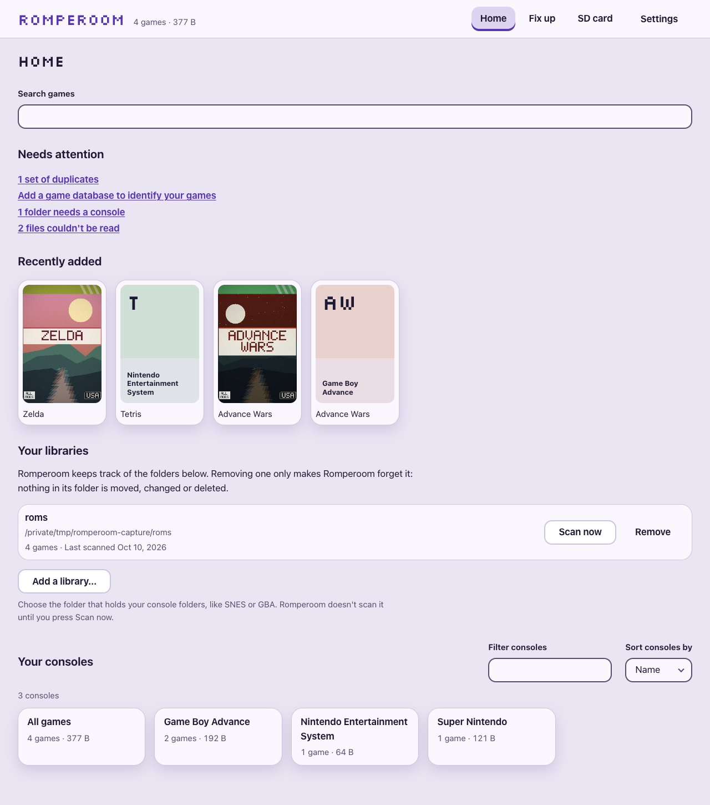
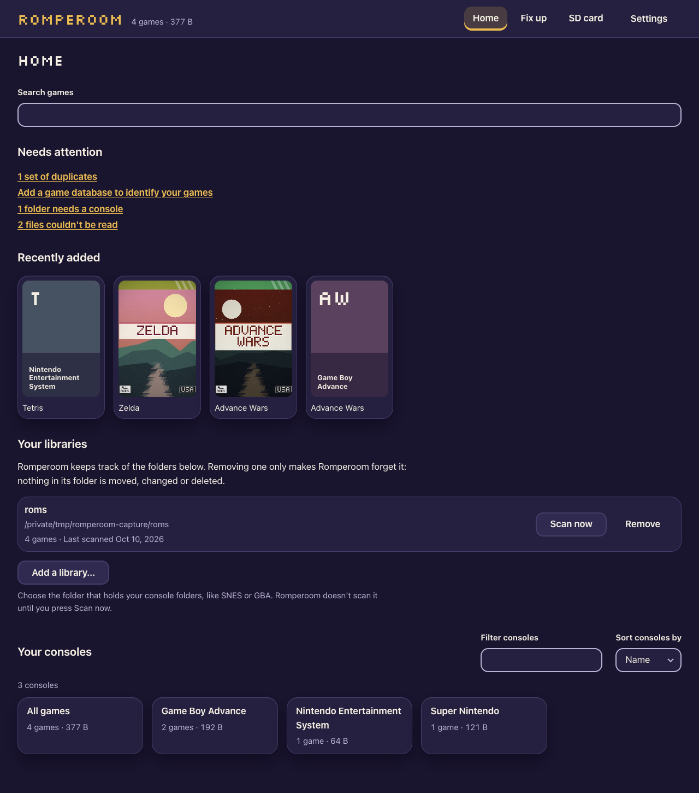

# Romperoom

Romperoom organizes a retro game library: it finds the games in your ROM folders, shows them as
a wall of covers, one shelf per console, and checks the library's health. It runs entirely on
your computer. Romperoom never includes or downloads games.

| Light | Dark |
| --- | --- |
|  |  |

More screens, step by step, are in the [user guide](docs/user-guide.md).

This repository holds the **releases only**: installers, checksums and release notes. There is
no source code here.

## Contents

- [Download](#download)
- [Using Romperoom](#using-romperoom)
- [Documentation](#documentation)
- [Check your download](#check-your-download)
- [Install](#install)
- [Opening a build that is not code-signed](#opening-a-build-that-is-not-code-signed)
- [Your data and uninstalling](#your-data-and-uninstalling)
- [Reporting a problem](#reporting-a-problem)
- [Privacy](#privacy)
- [License](#license)

## Download

The latest version is **0.12.0** (beta). Every version is on the
[releases page](https://github.com/MakerCorn/romperoom-releases/releases); the newest is
[here](https://github.com/MakerCorn/romperoom-releases/releases/latest).

| Computer                       | Download                                                              |
| ------------------------------ | --------------------------------------------------------------------- |
| Mac with Apple silicon         | `Romperoom-0.12.0-mac-arm64.dmg` (or the `.zip` of the same app)       |
| Windows 10 or 11, 64-bit (x64) | `Romperoom-0.12.0-win-x64.exe` (installer) or the `.zip`               |
| Linux, 64-bit (x64)            | `Romperoom-0.12.0-linux-amd64.deb` (Ubuntu, Debian) or the `.AppImage` |

Requirements: macOS 12 or later on Apple silicon; Windows 10 or 11 on a 64-bit Intel or AMD
processor; a 64-bit Linux with a desktop (the `.deb` for Ubuntu 22.04+ or Debian 12+). Intel Macs
are not supported yet.

## Using Romperoom

The [user guide](docs/user-guide.md) walks through every screen: setting up your library,
browsing, library health, putting games on an SD card, and tidying up.

## Documentation

<!-- docs-index:start (generated on each release from the source repository; edits here are replaced) -->

Everything below lives in [docs/](docs/); the [documentation index](docs/README.md) links all of
it in one place. Most of it is written for players, but a few pages are for the technically
curious.

| Document | What it covers |
| --- | --- |
| [Documentation index](docs/README.md) | One page linking to every document below. |
| [User guide](docs/user-guide.md) | A walk-through of every screen in Romperoom, with pictures. |
| [Troubleshooting](docs/troubleshooting.md) | Problems you might run into and what to do about them; none of them can harm your collection. |
| [Supported systems](docs/systems.md) | Every console and computer Romperoom recognises, and the folder names it looks for. |
| [Roadmap](docs/roadmap.md) | What Romperoom can already do, and what is still being built. |
| [Architecture](docs/architecture.md) | How the app is put together under the hood, for the technically curious. |
| [Development](docs/development.md) | How to build and run Romperoom from its source code. |
| [Testing](docs/testing.md) | How Romperoom is tested before a release goes out. |
| [Configuration](docs/configuration.md) | The handful of settings and options an advanced user can change. |
| [Device profiles and systems](docs/profiles.md) | How Romperoom knows what an SD card or handheld needs, and how that list is kept. |
| [Release process](docs/release.md) | How a new version is built, checked and published. |
| [CI runners](docs/ci-runners.md) | The computers that build and test Romperoom automatically. |
| [Security](docs/security.md) | What Romperoom protects, and how it is locked down. |
| [Decisions](docs/decisions.md) | Short notes on some of the bigger choices behind how Romperoom works, and why. |

<!-- docs-index:end -->

## Check your download

Each release has a `SHA256SUMS.txt` that lists the SHA-256 checksum of every file. Download it
into the same folder as your download, then compare.

macOS (Terminal, in the download folder):

```sh
shasum -a 256 -c SHA256SUMS.txt --ignore-missing
```

Each file you downloaded must say `OK`.

Windows (PowerShell, in the download folder):

```powershell
Get-FileHash -Algorithm SHA256 .\Romperoom-0.12.0-win-x64.exe
```

The `Hash` it prints must equal the line for that file in `SHA256SUMS.txt` (PowerShell prints
it in upper case; the file lists it in lower case: compare them ignoring case).

Linux (a terminal, in the download folder):

```sh
sha256sum -c SHA256SUMS.txt --ignore-missing
```

Each file you downloaded must say `OK`.

If a checksum does not match, do not open the file: download it again, and report it if it
still does not match.

## Install

- **macOS:** open the `.dmg` and drag **Romperoom** onto **Applications**. Then open it once the
  way [below](#opening-a-build-that-is-not-code-signed) describes.
- **Windows:** run the installer. It installs for your user only and needs no administrator
  rights. It asks where to install (by default `%LOCALAPPDATA%\Programs\Romperoom`) and adds
  Start menu and desktop shortcuts. The `.zip` holds the same app without an installer: unzip it
  anywhere and run `Romperoom.exe`.
- **Linux (Ubuntu, Debian):** install the `.deb`, for example
  `sudo apt install ./Romperoom-0.12.0-linux-amd64.deb`, then open Romperoom from your
  applications. Other distributions: make the `.AppImage` executable
  (`chmod +x Romperoom-*.AppImage`) and run it. On Ubuntu 23.10 and later the AppImage may refuse
  to start because of a system restriction on Electron's sandbox; use the `.deb` there, and never
  run Romperoom with `--no-sandbox`.

## Opening a build that is not code-signed

The beta builds are **not code-signed**. Code signing needs paid certificates (an Apple
Developer ID, and a Windows code-signing certificate), and Romperoom does not have them yet.
The builds are checked in other ways: every file has a published checksum, and each build is
made and tested by an automated pipeline before it is released. Because the builds are
unsigned, macOS and Windows warn you the first time you open them.

**macOS** says Romperoom cannot be opened (or that Apple cannot check it for malicious
software). To open it anyway
([Apple's instructions](https://support.apple.com/guide/mac-help/mh40616/mac)):

1. Try to open Romperoom once, and close the warning.
2. Open **System Settings**, then **Privacy & Security**, and scroll to **Security**.
3. Next to the message about Romperoom, click **Open Anyway** (it is offered for about an hour
   after you tried to open the app), and confirm with your login password.

After that it opens normally. On older macOS versions you can instead Control-click (or
right-click) Romperoom in Applications, choose **Open**, and confirm.

If macOS still refuses, or says the app is damaged, remove the download's quarantine flag in
Terminal, then open it again:

```sh
xattr -dr com.apple.quarantine /Applications/Romperoom.app
```

Only do this for a download whose checksum matched.

**Windows** may show "Windows protected your PC" (Microsoft Defender SmartScreen) because the
installer is new and unsigned. Click **More info**, check that the file is the Romperoom
installer you downloaded, then click **Run anyway**.

## Your data and uninstalling

Romperoom keeps its catalogue (what it found in your library, your settings) in one folder:

| System  | Data folder                               |
| ------- | ----------------------------------------- |
| macOS   | `~/Library/Application Support/Romperoom` |
| Windows | `%APPDATA%\Romperoom`                     |
| Linux   | `~/.config/Romperoom`                     |

Your ROM library is never stored there, and Romperoom does not change your game files.

To uninstall:

- **macOS:** quit Romperoom and drag it from Applications to the Bin.
- **Windows:** Settings, Apps, Installed apps, Romperoom, **Uninstall** (or the unzipped folder,
  if you used the `.zip`).
- **Linux:** `sudo apt remove romperoom` for the `.deb`, or delete the `.AppImage`.

Uninstalling keeps the data folder, so a reinstall picks up where you left off. Delete the
folder too to remove everything.

## Reporting a problem

Please [open an issue](https://github.com/MakerCorn/romperoom-releases/issues) in this repository. Say which
version you use (it is in the release you downloaded), your computer (macOS or Windows
version), what you did and what happened. Leave out personal file paths and folder names you
would rather not share.

Security problems: please do **not** open a public issue; see [SECURITY.md](SECURITY.md).

## Privacy

Romperoom works offline. It sends nothing about you or your library anywhere: no accounts, no
telemetry, no analytics, no crash reports. It connects to the internet only when you press
Download for me or Check for updates (Settings › Game databases) or Get cover art (Health), and
then only to GitHub, which sees which consoles' game databases and which games' pictures were
asked for. It does not update itself: new versions are published here.

## License

**All rights reserved.** Romperoom is proprietary software. No license is granted to copy,
modify or redistribute it, and its source code is not public.

Romperoom includes third-party open-source software, Electron among it, each under its own
license. The list and the license texts ship inside the app in `THIRD_PARTY_NOTICES.txt`
(macOS: `Romperoom.app/Contents/Resources`; Windows: the `resources` folder of the
installation). Chromium's own notices are in `LICENSES.chromium.html` (macOS: the same folder;
Windows: the installation folder).
