# Architecture

Romperoom is an npm-workspaces monorepo. Everything that touches your files lives in
`packages/engine`, which knows nothing about Electron. The desktop app is a thin host around it.

| Workspace           | What it holds                                                           |
| ------------------- | ----------------------------------------------------------------------- |
| `packages/profiles` | The canonical system list (`SYSTEMS`), device profiles and their schema |
| `packages/engine`   | Catalog (SQLite), scanner, hash pool, operations, deploy planner        |
| `packages/ui`       | Design tokens, three themes (each light and dark), React primitives     |
| `apps/desktop`      | Electron main process, preload bridge and the React renderer            |

Build order is profiles, then engine, then the rest: the desktop app consumes the engine's
built `dist/`.

## Processes and IPC

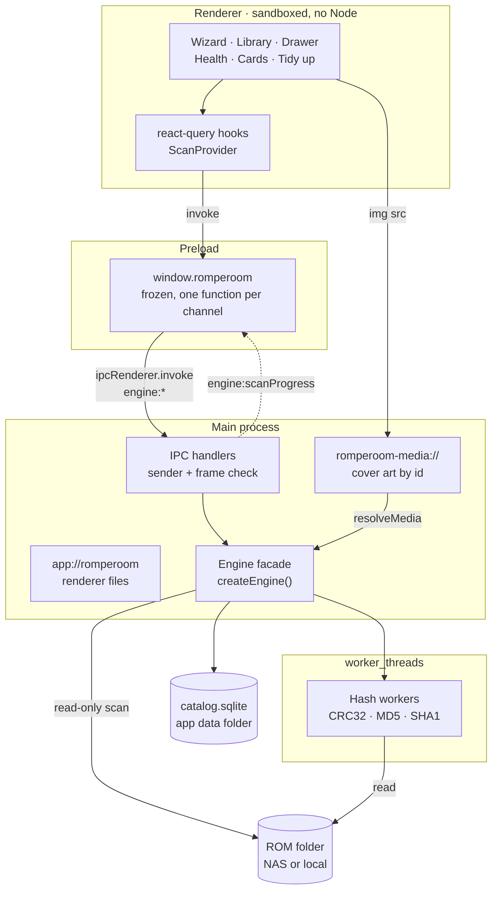

- The renderer is served from `app://romperoom/`, never `file://`. The CSP blocks all network
  and file access: `connect-src 'none'`, no frames, no workers. WebRTC, which CSP does not
  govern, gets no UDP (the IP handling policy) and no TCP (the session's dead proxy). No
  hostname is ever looked up inside Chromium (the process-wide host resolver rules; the game
  database download resolves its two GitHub names through Node, see
  [security.md](security.md#main-process-requests)), and every session, the ones
  made later included, gets the same proxy and permission denials.
- `window.romperoom` exposes exactly the channels in `apps/desktop/src/shared/ipc.ts`, plus
  `onScanProgress`. The type check pins the channel list to the `RendererApi` type in both
  directions.
- Every handler resolves to `{ ok, value }` or `{ ok: false, error: { name, message } }`. A stack
  never crosses the bridge. `contextBridge` keeps only an Error's message, so the preload writes
  the name into it (`LibraryBusyError: ...`) and `errorNameOf()` reads it back: the screens tell
  "busy" from "drive not connected" by name.
- Scan progress is pushed from main to the renderer. No callback crosses the process boundary.
  It says `walking` while the system folders are walked: the total still grows, so the bar is
  indeterminate ("Looking for games… 1,203 found so far"). Once every folder is walked it says
  `hashing` with the final total, and the bar counts ("Checking 240 of 1,203"). The walk is
  paced by the hashing it feeds, so a first scan stays indeterminate until its last folder is
  walked.
- Cover art is fetched by catalogue id. The main process resolves the id to a file under a known
  library, then opens it with `O_NOFOLLOW` and checks it through the file descriptor, which must
  still be the file the name points at.

The full list of security rules is in
[security.md](security.md).

## Catalog schema

The catalog is one SQLite file in the app data folder. It is never kept on the NAS. There are
fifteen migrations: migration 1 creates the core tables, and migration 2 rebuilds `media` as a
per-file table and adds the persisted scan state to `source_root`. Migration 3 adds the retry
and confirmation columns (`unreadable_count`, `last_error`, `last_verified`,
`last_complete_scan_id`) and `media.checksum`, and rebuilds `folder_map` and `unmapped_folder`
so their rows are deleted with their library. Migration 4 adds `ignored_folder`: the top-level
folders the user said hold no games (see [Ignored folders and scoped scans](#ignored-folders-and-scoped-scans)).
Migration 5 adds `game.display_title`: the title without a collection's running index, or NULL
when there is none (see [Collection indexes](#scanning-and-its-safety-guards) below).
Migration 6 adds `source_root.bios_folder`: the folder whose files a device package copies as
BIOS, or NULL (see [Deploy planner](#deploy-planner)).
Migration 7 is for tidying: it adds the `quarantined` status to `file` and `media`, the
`operation` and `purge_item` tables, the journal's root identity and `blocked_reason`, and the
step columns that name the catalog row, the copy to keep and the expected content (see
[Tidying the library](#tidying-the-library)). Migration 8 adds `file.sha1_whole` (the hash of
the file as stored; for a plain file it is copied from `sha1`, for an archive it is left NULL
until the next scan) and `file.entry_count`, and rebuilds `operation` (statuses `cancelled` and
`interrupted`, `fatal_reason`, `fatal_message`) and `op_step` (status `skipped`) with foreign
keys off for the copy. Migration 9 adds `op_journal.root_names` (the library's top-level folder
names when the journal was written; NULL on older journals) and the `library_reconnect` audit
table (see [Operations and the journal](#operations-and-the-journal)). Migration 12 adds the
headerless hashes (`crc32_nohdr`, `md5_nohdr`, `sha1_nohdr`, `header_skip`), `hash_version`
(1 on every existing row) and `file_entry` (see [Hash worker pool](#hash-worker-pool)).
Migration 13 adds stable game keys and each file's DAT match, and migration 14 turns the file's
rejected DAT game key into a list of every one the user rejected (`rejected_keys`; see
[Identification](#identification)). Migration 15 adds `dat_origin`: one row per downloaded DAT
(URL, commit, git SHA, licence, fetch time), written in the transaction that marks the DAT ready
and deleted with it; a DAT imported from the picker has none. Opening a catalog written by a
newer build is refused rather than downgraded.
Systems are not a table:
`system_id` refers to the `SYSTEMS` catalog in `packages/profiles` (`data/systems.json`, listed
in [systems.md](systems.md)). The connection
runs in WAL mode with `busy_timeout = 5000` (`BUSY_TIMEOUT_MS` in `catalog/db.ts`): a statement
waits up to 5 seconds for another connection's lock (a backup tool, the SQLite CLI) before
failing with `SQLITE_BUSY`.

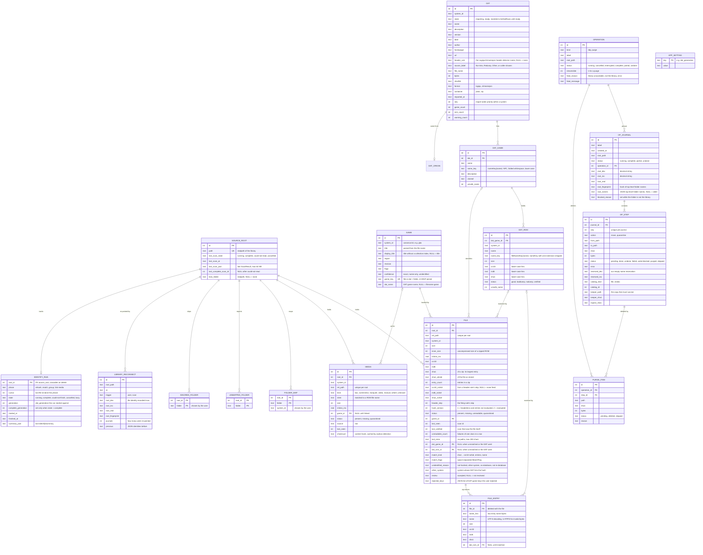

- A file that disappears is marked `missing`, never deleted from the catalog. Removing a library
  removes its catalog rows only, never files.
- A game is identified by `game_key` (migration 13): a filename game by its system, title and
  region, an identified game by its DAT game name, so two revisions of one title are two games.
  An identified game's title, region, revision and flags are parsed from the DAT game's
  description when one is left after cleaning (`cleanTitle`: invisible and bidi controls removed,
  at most 255 characters, applied at import and again when shown), else from its name:
  FinalBurn Neo names games by set ids (`jpark`) and keeps the title in the description. Each
  identify run writes those four fields again, so a corrected description retitles a game
  without changing its key. Region tags read No-Intro, TOSEC, GoodTools and FinalBurn Neo's
  abbreviations (`Euro`, `Jpn`, `Bra`, `Kor`, `Aus`, `Tw`).
  A rescan keeps a file's game and DAT match while its content is unchanged (same SHA1 and, for
  a zip, the same whole-file SHA1). Changed content or a remapped folder returns it to its
  filename game and clears the match; an unreadable file loses both. A rejection survives.
- Duplicates are files with the same SHA1 in more than one place. Zero-byte files are never
  grouped. The health page counts them as the duplicate cleanup does: within one library, by
  whole-file SHA1, copies of one console only (see [Tidying the library](#tidying-the-library)).
  Only the disk can tell a hard link or a disc set, so the cleanup may offer fewer than health
  counts. Different regions of one game are separate games, not duplicates.
- Only **confirmed** files count as duplicates. A file is confirmed when it is `present`, its
  library has finished a complete scan (`last_complete_scan_id` is set), and that scan saw the
  file itself (`last_verified >= last_complete_scan_id`). Rows a scan kept without seeing them
  (under a suspect, absent, permission-denied or symlinked folder, or in a library that could not
  be read) are unconfirmed: a remounted share cannot produce ghost duplicates. Sizes, games and
  systems still count every `present` file; `unconfirmedFiles` (health) and `unconfirmedBytes`
  (sizes) say how much of that is unconfirmed. A complete scan sets `last_complete_scan_id` to
  its scan id; could-not-read or a failed scan clears it; a cancelled scan leaves it alone.
- A **case-only rename of a system folder** (for example `PSX` to `psx`, or an NFD to NFC
  spelling) is a relocation ONLY when both spellings resolve to the same directory. Before the
  walk, a listed folder with no catalog rows whose case-folded, NFC name matches exactly one
  absent folder with live rows is a candidate. Both spellings are then looked up under the root
  (`lstat`, through the `WalkFs` seam): only the same device and inode make it a relocation. On
  a case-sensitive volume the old spelling is gone (`ENOENT`), or is another folder, so a new
  `psx` next to a vanished `PSX` stays two folders: `PSX` is absent and kept, `psx` is new. Any
  other lookup error is logged and treated as no relocation. A relocation takes over the old
  folder's file and media rows, its folder mapping, its unmapped entry and its ignore, in one
  transaction. An ignored folder with no catalog rows is never a candidate, so renaming only its
  case loses the ignore: the new spelling shows up as unmapped again.
  Hashes are kept; the walk then checks each file's size and mtime as usual.
- `last_scan_json` keeps the last scan's outcome, so the health page survives a restart. When it
  would pass 64 KB, its lists are halved and `truncated` is set. While a scan runs, the state is
  `running`; a later start that still finds `running` reports the scan as interrupted.

## Scanning and its safety guards

A scan is read-only. The one thing it must never do is mistake an unreachable or half-mounted
NAS for deleted games. An unmounted share usually looks like an empty folder, not an error. So
every step that could mark rows `missing` is guarded, and whenever in doubt the scan keeps the
rows.

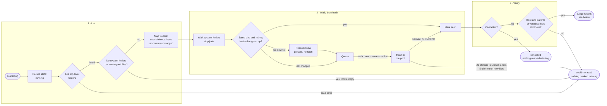

A scan that gets this far judges each folder, for files and for media separately:

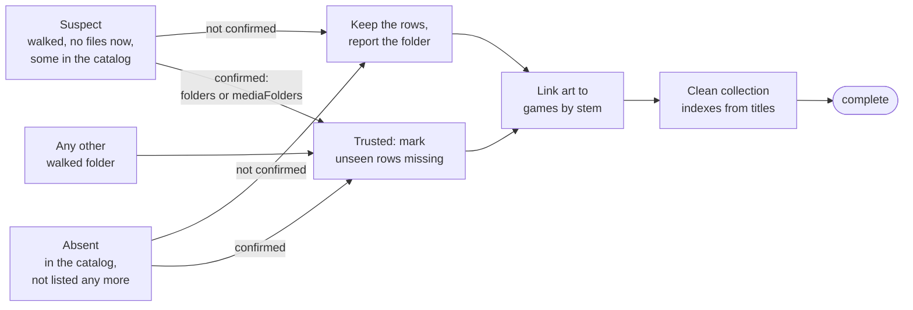

- **Folders and files at once.** On a network share every directory listing and every `stat`
  waits on a round trip. Up to `WALK_CONCURRENCY` (4) system folders are walked together
  (`scanner/merge.ts`, `mergeIterators`), and within a directory up to `STAT_CONCURRENCY` (16)
  files are stat'ed at once and still yielded in name order. Measured with the real scan on a
  NAS library of 22,331 games in 224 folders: the walk went from 6.8 to 4.7 minutes. The merge
  is lazy (a folder is read on only as fast as the scan takes its files) and every file is still
  settled one at a time, so catalog writes never interleave. A folder or file that fails as
  unreachable ends the walk, after the others are closed; stats still in flight then settle
  without being reported.
- **The library before hashing.** The walk runs to the end before anything is hashed, and every
  file it finds for the first time is recorded at once (`present`, no hashes, with its game):
  the library shows every game minutes into a scan, while hashing, bound by how fast the files
  can be read (about 6.6 hours for 419 GB at the 17 MB/s one NAS gave), carries on. Only new
  files: a changed or retried file keeps its row until a hash settles it. A row without a hash
  is never settled (`isSettled`), so a cancelled scan's are hashed by the next one; a scan that
  ends could-not-read removes the rows it recorded this way, so it changes nothing; a new file
  gone by hash time leaves no row. Files whose size another file in the library shares are
  hashed first: exact copies always share a size, so duplicates show up early.
  `HealthSummary.uncheckedFiles` counts present files without a hash.
- **Whole-root guard.** No system folder is listed while the catalog still has files for the
  library. The scan ends `could-not-read` with "The library folder looks empty ...". Media roots
  (`downloaded_media`, `.romperoom/media`) never vouch for the ROMs. This guard runs before any
  folder is judged, so confirming a removal does not lift it.
- **Storage failures.** Timeouts, worker crashes and storage I/O errors while hashing count as
  infrastructure failures. 25 in a row end the scan `could-not-read` once at least 5 of them
  were on new or changed files. A retry of a file that is already `unreadable` at the same size
  and mtime is expected to fail again (a bad sector fails every time), so a run made of retries
  does not end it however long it gets: only 500 failed retries in a row, in a scan where
  nothing else answered (no file hashed and no content failure), end it `could-not-read`. A
  library whose bad files sit among good ones therefore stays `complete`, scan after scan. Content failures and successes end a streak; held-back
  failures are written only if the scan completes. A file that fails to hash for another reason
  becomes `unreadable`, never `missing`. A path the walker could not read (for any code but
  `ENOENT`) keeps every catalogued row under it.
- **Files changing under the scan.** Each hash is given the size the walk saw. A file whose
  size no longer matches (still being copied onto the NAS, rewritten or truncated) fails with
  `file changed during scan: ...`, an infrastructure failure: the file is `unreadable`, and the
  next scan hashes it again.
- **Unreadable files are retried.** Every scan hashes an `unreadable` file again, so a NAS
  glitch heals on the next healthy scan (the file counts as `changed`). `unreadable_count`
  counts the failures in a row of one class (content, timeout or other infrastructure) at the
  same size and mtime; a failure of another class, or a changed file, starts it again at 1. A
  content failure (a corrupt or encrypted archive) 3 times in a row leaves the file alone until
  its size or mtime changes. An infrastructure failure 10 times in a row backs the file off: it
  is then tried only on every 10th scan of it (scans 1 to 10, then 20, 30, ...; the count goes
  on counting the scans it sat out), but never given up on, since storage can recover. A hash
  that timed out backs off after 3 in a row instead, so a file that hangs the drive costs 10
  minutes on 3 scans, not 10. The row keeps the last error, with every path removed, and the
  class is read back from that error.
- **Trying again on request.** `scan(rootId, { retryUnreadable: true })` (Health's "Try again")
  hashes every `unreadable` file in that scan, backed off or settled; the counts carry on after
  it. `listUnreadable({ rootId?, offset, limit })` pages through the unreadable files (at most
  200 at a time) with a plain reason for each (`unreadableReason`: damaged zip, encrypted,
  too large, no permission, storage error, timed out, changed while reading, unknown), the
  total and a count per reason.
- **Vanished re-verify.** A file or folder that disappears during the scan (`ENOENT`/`ENOTDIR`)
  counts as gone, but only after the end-of-scan re-read shows that its parent folder and the
  root are still there. A share that unmounts mid-scan therefore ends `could-not-read`.
- **Suspect and absent folders.** A walked folder with no eligible files left, or a catalogued
  folder that is no longer listed, keeps its rows. The folder is reported (`suspectFolders`,
  `absentFolders`) until the user confirms it with `confirmRemoval.folders`.
- **Files and art are confirmed separately.** Media has its own lists (`mediaSuspectFolders`,
  `mediaAbsentFolders`) and its own confirmation (`confirmRemoval.mediaFolders`). Confirming
  "the artwork was removed" can never retire ROMs, and confirming ROMs never retires art. The
  health page offers the two as separate buttons, per library.
- **What is catalogued.** A file in a system folder is a ROM when its extension is in that
  system's `extensions` (`packages/profiles/data/systems.json`, taken from ES-DE and Batocera;
  see [systems.md](systems.md)). Most systems take `.zip` and `.7z`; engines and ports take
  their own launch files. Each file of a disc image is its own row: a `.cue` and its `.bin`, or the discs and
  the `.m3u` playlist of a multi-disc game, are files of one game, so sizes count the whole
  image. Identify groups a cue sheet with its tracks (see [Identification](#identification)).
  Release documentation
  (`isDocumentationName`: a basename starting with the word readme, license, licence,
  changelog, notes or copying, with a md, txt, nfo, url, html or pdf extension) is never a ROM
  and never a manual, even where `.md` is a Genesis extension.
- **Ignored files are counted.** `ignored` counts everything skipped. `ignoredByExtension`
  breaks the files skipped for their extension down by extension (at most 32 keys; the rest add
  up under `(other)`), and health lists the top 5 over all libraries, so a missing extension
  shows up instead of silently shrinking the library.
- **Collection indexes.** Some collections number every file ("001 - Super Mario World",
  "002 - ..."). At the end of each complete scan, `detectIndexPrefix` (in `title.ts`) looks at
  the titles of the files directly in each walked directory (a system folder and each of its
  subfolders on its own, since collections often number one subfolder beside plain ones), in
  walk order: when at least 20 names are given, at least 70% of them start with 2 to 4 digits
  and a separator followed by a name, and those numbers are at least 90% unique and at least
  90% going up, the directory is numbered. Its games get `display_title` without the index.
  Any other directory's games get NULL, so a directory that stops looking numbered shows its
  file names again, and one "007 Nightfire" among ordinary names keeps its number. `listGames`
  shows, searches and sorts `COALESCE(display_title, title)`, and so does the largest-games
  list. A game with files in two directories takes the verdict of the directory judged last.
- **Housekeeping folders are skipped at any depth**: `@eaDir`, `#recycle`, `#snapshot`,
  `@Recently-Snapshot`, `@Recycle`, `@Transcode`, `.@__thumb`, `lost+found`, `$RECYCLE.BIN`
  and `System Volume Information` (`IGNORED_DIRS` in `scanner/walk.ts`, compared without case).
- The engine runs one scan at a time. Every end state is persisted, and a scan that throws
  is recorded as `could-not-read`.

### Ignored folders and scoped scans

Two ways to leave folders out of a scan. Both keep catalog rows as they were: a folder the scan
does not look at is never judged, so nothing under it becomes `missing`.

- **Ignored folders** (`ignoreFolder`, `unignoreFolder`, `listIgnored`; table
  `ignored_folder`) persist per library. An ignored top-level folder is not walked, not listed
  as unmapped, never suspect or absent, and its media root is not walked either. Health lists it
  in `ignoredFolders` with the number of live rows the catalog still holds under it, and the
  scan result names the ignored folders it listed. Assigning a system to a folder includes it
  again; so does `unignoreFolder`, after which a folder no system resolves to is unmapped at
  once. Removing the library removes its ignores (`ON DELETE CASCADE`).
- **Assigned folders** (`assignFolder`, `unassignFolder`; table `folder_map`) map a top-level
  folder to a system. `assignFolder` drops the folder's unmapped entry and its ignore.
  `unassignFolder(rootId, folder)` undoes it: it deletes the mapping and, when no system resolves
  the folder by name, lists the folder as unmapped again at once. A folder with no mapping is left
  as it is. Both validate their arguments the same way. The games a scan already added from the
  folder stay after an undo: a scan does not walk an unmapped folder, so it never judges them
  (an ignored folder behaves the same).
- **Scoped scans** (`ScanOptions.onlyFolders`, at most `MAX_CONFIRM_FOLDERS` = 500 top-level
  names, each validated like a folder argument) judge only the listed folders. An ignored folder
  stays skipped even when listed. A media root is walked only when it is listed. The whole-root
  guard still looks at the full listing, so a scoped scan of an empty-looking share still ends
  `could-not-read`. The result carries `onlyFolders`; unmapped folders outside the scope are not
  reported.
- **The unmapped list is replaced, not appended to.** Each complete scan drops the stored
  unmapped entries for the folders it judged and did not find unmapped again (`replaceUnmapped`),
  so a renamed or removed folder leaves the wizard's list. Folders the scan did not judge keep
  their entries: out-of-scope folders of a scoped scan, and ignored folders (so including one
  again lists it at once). A could-not-read scan leaves the list alone.
- **Confirmation is carried, never invented.** A complete scoped scan sets
  `last_complete_scan_id` like any complete scan, which would make every folder it did not look
  at unconfirmed. So before that, rows outside the scope that the previous complete scan
  confirmed (`present` and `last_verified >= ` the previous `last_complete_scan_id`) get the new
  scan id as `last_verified` (`carryConfirmation`). Rows that were unconfirmed stay unconfirmed,
  and after a could-not-read (no previous complete scan) nothing is carried: only a full scan
  confirms them again. Ignored folders are carried the same way.
- The desktop app's wizard offers both: "Not a console — ignore this folder" in each unmapped
  folder's picker, "Ignore all remaining" when more than five need a console, and health's
  "Include again". A scoped scan has no screen yet; the test seam `ROMPEROOM_TEST_SCAN_ONLY`
  (see [configuration.md](configuration.md#environment-variables)) drives it in live runs. A screen that
  offers it must say which folders will not be checked, since their rows are kept unverified by
  this scan.
- **Choosing is not assigning.** A picker only chooses: type-ahead in a focused `<select>`
  changes its value once per key, so assigning on change would assign every console the keys
  pass through. Each folder has its own button, disabled until something is chosen, labelled
  "Assign" (or "Ignore folder" for "Not a console") and described by the folder's name. "Use
  suggestion" only fills the picker in and moves focus to that button. "Ignore all remaining"
  skips folders that are on their way out or have a console chosen and not assigned yet.
- A sorted folder leaves the list once health is refetched. Focus then moves to the next
  folder's picker, or to the list's heading after the last one (the list stays, saying "Every
  folder is sorted"), unless the player has already moved it. The app's polite live region says
  what happened ("Assigned Retro to Super Nintendo. Undo is under Recently assigned.", "Ignored
  Tools"). A folder that comes back (an undo, a rescan) starts with nothing chosen. Each picker
  lists every console only once it is focused or pressed. Until then it holds only its two fixed
  choices and the suggestion. 200 folders shown were 61,800 options (Show all took 0.6 s); now
  they are 400 (0.05 s).
- **Recently assigned** lists this session's assignments, newest first, under the wizard's list
  and in health, each with "Undo" (`unassignFolder`). The list lives in a store above the
  screens (`data/recent.tsx`), so it lasts while the window is open, not across restarts. After
  an undo, focus moves to the next entry's Undo or to the list's heading (it stays, saying
  "Nothing left to undo"), and the live region says "Undone: Retro no longer goes to Super
  Nintendo".

A hash failure is classified by its message (`isInfraFailure`, `isVanished` and `INFRA_CODES` in
`packages/engine/src/scanner/scan.ts`). Vanished files are not seen, and the end-of-scan re-read
decides. Infrastructure failures form streaks and back off, as described above (Infra in the
table). Content failures make the file `unreadable` and are left alone after 3.

| Class    | Why               | Errno codes or messages                                       |
| -------- | ----------------- | ------------------------------------------------------------- |
| Vanished | Deleted mid-scan  | `ENOENT`, `ENOTDIR`                                           |
| Infra    | Storage gone      | `EIO`, `ETIMEDOUT`, `ENOTCONN`, `EHOSTDOWN`, `EHOSTUNREACH`   |
| Infra    | Storage gone      | `ESTALE`, `ENXIO`, `ENETDOWN`, `ENODEV`                       |
| Infra    | No resources      | `EMFILE`, `ENFILE`, `ENOMEM`, `ENOSPC`, `EBUSY`, `ETXTBSY`    |
| Infra    | Interrupted       | `EAGAIN`, `ECONNRESET`, `ECANCELED`, `EINTR`                  |
| Timeout  | Hash pool         | `hash timed out` (its own count: backs off after 3)           |
| Infra    | Hash pool         | `pool closed`                                                 |
| Infra    | Worker crash, OOM | `hash worker failed`                                          |
| Infra    | Still copying     | `file changed during scan:`                                   |
| Content  | The file itself   | Anything else: `EACCES`, `EPERM`, `EISDIR`, a corrupt archive |

## Operations and the journal

Moves and quarantines (`packages/engine/src/ops`) are planned, previewed, journaled and undoable.
"Delete" always means moving into `<library>/.romperoom-quarantine`. The engine applies plans for
the duplicate and artwork cleanups ([Tidying the library](#tidying-the-library)), which the
Tidy up screens run.

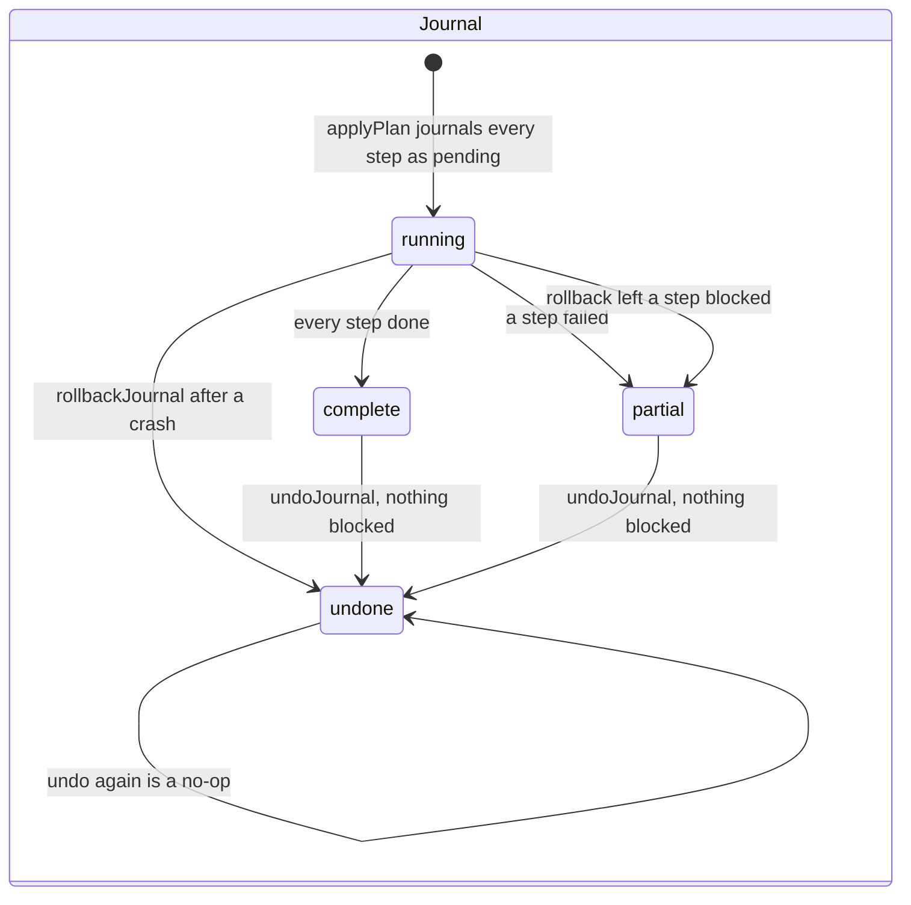

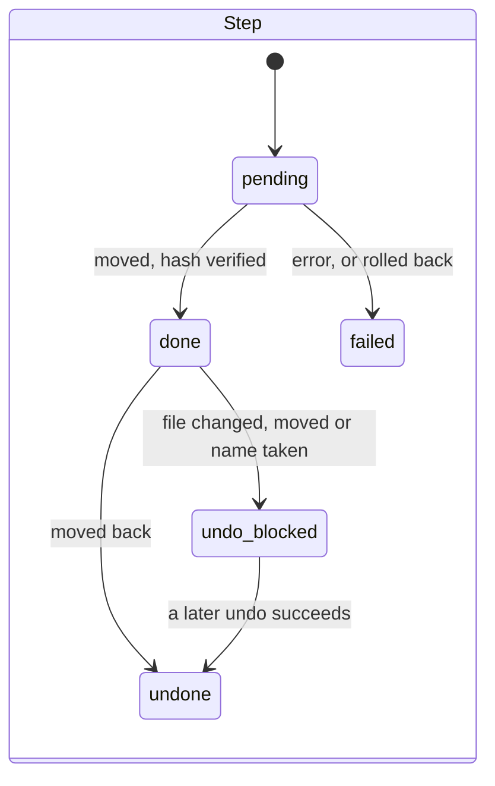

- Every step is written `pending` in one transaction before anything moves. A crash therefore
  leaves a `running` journal, and `findPendingJournals` finds it. `finishJournal` completes it by
  checking what actually happened on disk to each pending step, ending `complete` or `partial`
  like a normal apply. `rollbackJournal` first reconciles the pending steps with the disk, then
  undoes the done ones in reverse. It ends `undone`, or `partial` if a step stayed blocked.
- An undo that leaves a step `undo-blocked` keeps the journal's status (`complete` or
  `partial`), so a later undo can retry it.
- Moves never overwrite: every rename goes through an exclusive (`O_EXCL`) name reservation
  whose device and inode are recorded (`reserved_dev`, `reserved_ino`). Cross-volume moves copy
  to a temporary name, verify the hash, rename into place, then remove the source.
- A step whose file changed since it was moved becomes `undo-blocked`, and the journal is never
  reported `undone` while a file still sits in quarantine.
- `undoJournal` refuses a `running` journal. Applying, finishing, rolling back and undoing take
  the library's work lock ([One work lock per library](#one-work-lock-per-library)).
- A journal records which folder it ran in: the device and inode of the library folder (decimal
  strings), its real path, and a fingerprint of its top-level folder names. No marker file is
  written into the library. Before anything is called missing, and before finish, rollback or
  undo touch a file, the folder must still be that library: the real path must match, and
  either the device and inode or the fingerprint (a network share gets a new device number
  every mount; a folder swapped in at the path keeps neither). An empty folder is never the
  library (an unplugged drive leaves its empty mountpoint). A mismatch throws
  `RootIdentityError`, records `blocked_reason`, and leaves every step as it was: nothing is
  marked failed, and the journal shows as `blocked-root` until the library is back.
- A library that was remounted, moved or had folders added is reconnected, not locked out for
  good: `tidy.reconnectLibrary(rootId, { confirm: true })` (the user answered "Is this still
  your library?") re-points the library's journals at the folder now at its path, clears
  `blocked_reason`, and writes one `library_reconnect` row holding what each journal had before.
  Each journal is checked on its own (`reconnectProblem`): an empty folder and a folder sharing
  none of the recorded top-level folders are always refused; otherwise the real path must be
  the recorded one, or at least 80% of the folders must be the same (Jaccard overlap of the
  recorded `root_names` and today's, NFC and case folded). It takes the work lock and never
  writes to the library.
- A complete, unscoped scan does the same by itself (trigger `scan`) so a network share's new
  device number every mount does not block undo later, but only at the recorded real path,
  with at least 80% of the folders the same (a journal older than migration 9 only when it
  still passes the device-and-inode-or-fingerprint check), and only when no journal of the library is
  running or blocked and no purge of it stopped part way (`scanRefreshProblem`). A failure
  there is logged, never fails the scan.
- A step that names a catalog row (`catalog_kind`, `catalog_id`) updates that row in the same
  transaction as the step's status: `done` moves the row to its quarantine path with status
  `quarantined`, `undone` puts it back as `present`, `purged` deletes it.

## One work lock per library

`withLibraryLock(paths, kind, fn)` (`packages/engine/src/lock.ts`) is the one lock for work on a
library. It is in-process: the desktop app already runs as one instance
(`app.requestSingleInstanceLock`), so there is no second process to exclude. Libraries overlap
when one path is the other or inside it. Taking a lock is synchronous and all-or-none, and the
release is idempotent and runs in `finally`. A refused request throws `LibraryBusyError`
(`code: 'LIBRARY_BUSY'`), which names the kind of job that holds the library, and starts
nothing: a refused scan records no scan result.

| Held \ requested | scan    | op      | deploy  | identify |
| ---------------- | ------- | ------- | ------- | -------- |
| scan             | refused | refused | refused | refused  |
| op               | refused | refused | refused | refused  |
| deploy           | refused | refused | shared  | refused  |
| identify         | refused | refused | refused | refused  |

- `scan`: a scan of the library. `op`: applying, finishing, rolling back or undoing a journal,
  a purge, and removing a library. `deploy`: a deploy reads its source libraries (the deploy
  facade itself runs one deploy at a time). `identify`: an identify run holds the library it
  is identifying; replacing or removing a DAT takes every library's `identify` lock for its
  transaction (see [Identification](#identification)).
- Only reads share: two deploys may read one library, nothing may change it while one does.

## Tidying the library

`packages/engine/src/tidy` cleans up duplicates and unused artwork. Everything goes through the
journal into quarantine first; the only permanent deletion is emptying the quarantine, which the
user confirms separately.

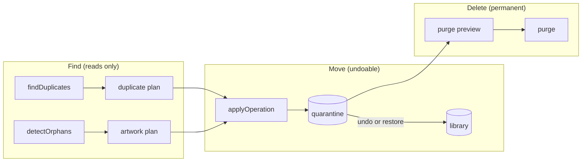

### The operation model

An **operation** is one user action: a `tidy` run (one or more journals, one per chunk of
steps) or a `purge` (irreversible, with one `purge_item` per file). An operation's status comes
from its journals: `complete`, `partial` or `undone` once every journal ended. While one has
not, it is `running` if this process is still running it, `cancelled` if the user stopped it,
and `interrupted` otherwise (the app stopped, or the library failed mid-run: `fatal_reason` and
`fatal_message` say why). A cancelled or interrupted run is finished or rolled back
(`resolveJournal`), like a crashed one.

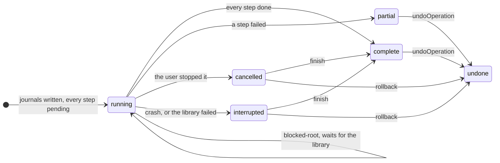

A catalog row follows its file:

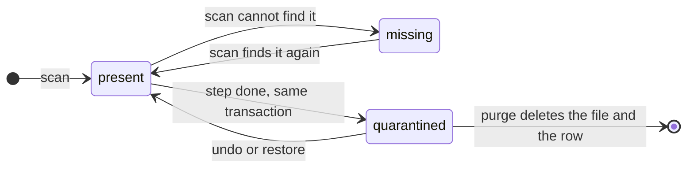

- A quarantined row keeps its catalog id and records its path inside the quarantine folder. The
  scanner never walks the quarantine folder and only marks `present` or `unreadable` rows
  missing, so a rescan never brings a quarantined row back. Counts, sizes, games, systems and
  duplicates exclude quarantined rows; `sizes()` and `health()` report `quarantinedFiles` and
  `quarantinedBytes` separately, from the journals.
- A restored row is `present` but unconfirmed until the next complete scan sees it (a scan ran
  while it was away). It is not grouped as a duplicate until then.
- Plans are pure data a caller can preview: every step names its source, destination, size,
  catalog row and, for a duplicate, the copy that must survive.
- `applyOperation` runs a plan in chunks (200 steps by default), one journal each, with one
  progress count across chunks and a summary: moved, freed bytes, failed with reasons, not run.
  A cancel stops between steps; later chunks never start; the rest are `not run`, never failed.
  Once a step has moved it never rejects: a library that goes away mid-run returns
  `status: 'interrupted'` with `fatal: { reason, message }`.

### Duplicates

- A group is files with the same whole-file SHA1 (`sha1_whole`) within one library and one
  console, all confirmed, larger than zero bytes. Two zips holding the same game with different
  extras (a save, a patch) are different files and never group; nor do a zip and a plain copy.
  An archive catalogued before migration 8 has no whole-file hash yet: it is counted as
  `notChecked` and never grouped. The Duplicates tab and the Overview say so, with **Scan
  again**.
- Left out, and listed read-only with the reason (`excluded`): hard links of one another
  (`same file`: removing one frees nothing), disc-set members (a cue, gdi, m3u or ccd sheet
  names it or sits beside it: `part of a disc set`), and the same bytes under two consoles
  (`shared by two consoles`: each frontend folder needs its copy). The disc-set check fails
  closed: a file whose folder cannot be listed, or whose parent folder (or a sheet there)
  cannot be read, counts as `part of a disc set` (sheets over 256 KiB are not parsed). The
  summary counts them all (`excluded`) and, apart from hard links, as `skipped`: the Duplicates
  tab and the Overview show "N files are skipped because they're part of a multi-file game or
  shared between consoles".
- One file per group is kept. The first rule that tells the copies apart decides, and is shown:
  identified by the catalog, then region (USA, Europe, Japan, World), then the highest revision,
  then clean (no `[b]`, `[h]`, `(Beta)`, `(Proto)` and similar tags), then plain over an archive
  (`prefer: 'archive'` reverses it), then the shallowest folder, the shortest path, the lowest
  id. A caller may pick the keeper of any group or skip groups.
- One plan per library: every other copy goes to `.romperoom-quarantine/<date>/<its path>`.
- The last-copy guard: when a step runs, the copy to keep is checked first (a regular file,
  inside the library, reached through no link: its real path is the library's real path plus
  its relative path) and hashed again, once per chunk. If it is missing or changed, the step
  fails and the copy stays. The copy to move must still have the content it was found with, be
  reached through no link, and not be the same file (device and inode) as any copy to keep.

### Unused artwork

`detectOrphans(rootId)` returns `{ status: 'ok', items, notRecognised }` or, when the catalog cannot tell,
`{ status: 'not-evaluated', reason }` (no complete scan, a file or picture the last scan did
not see, or an unreadable ROM). "Could not check" is never "nothing unused". A picture is unused
when:

| Cause             | Meaning                                                                |
| ----------------- | ---------------------------------------------------------------------- |
| `no-rom`          | No ROM of its system in its library has its name                       |
| `rom-gone`        | It was linked to a game that has no file left in its library           |
| `duplicate`       | Another picture of the same system, kind and name has the same content |
| `unmapped-system` | Listed apart in `notRecognised`, never cleaned (see below)             |

A ROM in quarantine still counts (it may come back), so its art is not unused. Duplicates are
found by name and size first, then by content hash, cached in `media.checksum` (a scan that sees
a new size or mtime drops it). Romperoom's own store (`.romperoom/media`) wins, then the
shallowest folder. A copy a frontend reads where it is (`downloaded_media/<system>/...`, or a
console folder's `images/` or `Imgs/`) is never listed as a duplicate. Art in a folder no
console is mapped to is "folder not recognised": what reads it is unknown, so it is listed in
`notRecognised` and a plan skips it. The plan carries the same last-copy guard as duplicates, so
it never removes the last copy of art for a ROM that exists.

### Emptying the quarantine

`purgeQuarantinePreview` is a dry run: it lists every quarantined file of a library and, for
each, whether it may be deleted. `purge` then requires the words `DELETE FOREVER` and the exact
byte count the preview showed, takes the work lock, checks the library's identity, and journals
the purge as an irreversible operation with every item `pending` before deleting anything. Each
file is checked again just before it is deleted (see
[security.md](security.md#emptying-the-quarantine)). Emptied folders are removed, deepest first,
retrying a folder another process holds open. A file whose restore was blocked stays listed
(`status: 'undo-blocked'`, with `blockedReason`) and can be restored again; a purge keeps it
unless asked with `includeUndoBlocked`.

### Recovery

`recoverJournals()` lists every journal and purge that did not end: `interrupted` (the app
stopped mid-run) or `blocked-root` (the folder at the library path is not the library). Nothing
in them is failed. `resolveJournal(id, 'finish' | 'rollback')` and
`resolvePurge(id, 'finish' | 'rollback')` settle one, under the work lock and with every check
of a fresh run. `health().interruptedOperations` counts them. While a purge is unfinished, a
restore or undo of its files is refused; finishing it never deletes a file that was restored
meanwhile (it is kept, "it was restored meanwhile", and the purge ends `partial`).

### The tidy facade

`engine.tidy` is the surface the desktop host calls
([The Tidy up screens](#the-tidy-up-screens)). Every input is checked at run time (zod,
strict), every result is plain JSON, and it accepts ids, never paths. What a caller saw is held under a random id (at most 16, for 30 minutes, least recently
used dropped first) and bound to the catalog's write generation: an id from before any catalog
change is refused with `plan-stale`, an unknown or expired one with `plan-unknown`, one of the
wrong kind with `plan-kind`. Plans and purge previews are single use.

### The Tidy up screens

`#/tidy` (`apps/desktop/src/renderer/tidy`) has five tabs: Overview, Duplicates, Leftover
artwork, History and Set aside. The words are plain: "set aside", never "quarantine", and the
folder is named once, in the preview.

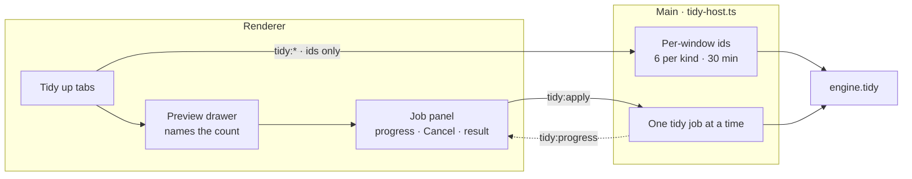

- **Ids only.** The page sends library ids, item ids from lists the host gave it, or random ids
  bound to its own window, which are forgotten when it navigates. The host checks every field
  before the engine checks it again. Paths it shows are library-relative, or cut to their last
  name.
- **One job.** A set-aside, an undo, a put-back or a delete-forever runs as the one tidy job.
  Progress and the result are pushed to the window that started it; `tidy:status` lets a
  reloaded page adopt a running job. Quitting while one runs asks first.
- **A preview before every change.** Its confirm button names the count, and Cancel has focus.
  Delete forever needs the words `DELETE FOREVER` typed exactly; the host passes the words and
  the size through, and the engine compares them.
- **A stopped run is finished or undone, not undone in part.** Cancel stops between files and
  leaves the run's journal `running`, so the engine refuses to undo it as a whole. Its result
  says what moved and what stayed, and offers **Finish or undo…**, which opens the recovery
  drawer for that run (`tidy:resolveJournal`).
- **Recovery at startup.** When the first health reading counts interrupted work, a drawer
  offers to finish or undo each item. A run stopped later in the same session is offered from
  its own result instead. When the drawer closes by itself, focus goes to `<main>`.
- **Errors** are plain words with the technical text under "Details": busy (a scan or a copy to
  a card holds the library), the library folder not available, or "your library changed since
  you looked" (a stale plan), which offers "Look again".

## Hash worker pool

Hashing runs in `worker_threads` (`hash/pool.ts`, `hash/hash-worker.mjs`). The engine creates
the pool lazily, when a scan starts, and closes it `POOL_IDLE_MS` (30 seconds) after the last
scan ends, so idle worker threads do not stay alive for the session; the next scan makes a new
one. Its default size is `min(4, CPU count)`: hashing a NAS is I/O-bound, and many parallel
reads slow it down.

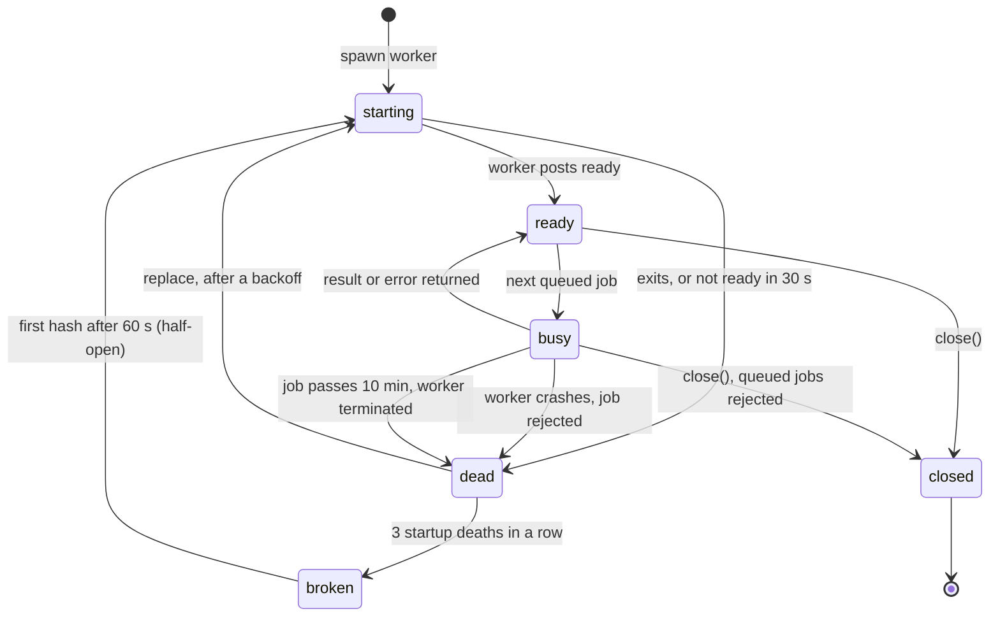

- Jobs go only to workers that have posted `ready`. A death before `ready` is therefore a true
  startup failure, and so is a worker that has not posted `ready` within 30 seconds (it is
  killed). Three in a row mark the pool broken, so a missing worker file cannot respawn forever.
- A broken pool rejects every hash for 60 seconds. The first hash after that goes half-open: one
  probe worker is spawned. If it becomes ready the pool refills to its size; if it fails to
  start the pool is broken for another 60 seconds.
- A worker that dies after `ready` is replaced at once the first time. Each further death with
  no successful job in between waits longer before the respawn: 100 ms, doubling to at most
  5 seconds. A successful job resets the delay.
- A job that runs past its timeout (10 minutes by default) is presumed wedged on a stalled read.
  The pool rejects the job and replaces the worker. The scanner counts that as a storage failure
  and marks the file `unreadable`, not `missing`.
- Zipped ROMs are hashed by their inner file, up to 8 GiB; `inner_size` records its size.
- `hash(path, { expectedSize })` checks the file against the size the walk saw. A plain file
  compares the bytes it actually read, and the read stops as soon as it overruns. A zip compares
  its on-disk size, and its inner entry must match its own declared size.
- `hash(path, { signal })` is cancellable. A queued job is dropped; a running one stops at once:
  its worker is terminated and replaced, as for a timeout, but nothing is counted against the
  pool. It rejects with `AbortError`. A scan passes its own signal, so **Cancel scan** returns
  within a moment even while multi-GB files are being read over a NAS, and a file cancelled
  mid-read is not recorded (it is hashed on the next scan).
- **Headerless hashes.** `hash(path, { headerRules })` takes the rules of the file's system
  (`HEADER_RULES[systemId]` in `hash/headers.ts`; the scan passes them). The worker holds back
  the first 512 bytes (`HEADER_PROBE_BYTES`), evaluates the rules on them (a rule's tests are
  ANDed, rules ORed, the first firing rule wins) and, when one fires, feeds a second set of
  hashers every byte from its skip on, in the same read. The result's `nohdr` holds those hashes
  and the skip; it is null when no rule fired or the file is no longer than the skip. The full
  hashes never change: a rule that fires on a headerless file only costs one extra hash. For a
  zip the rules are evaluated on its largest entry. The worker carries its own copy of
  `headerSkip` (it cannot import TypeScript); a test asserts the two agree.
- **The entry pass.** A zip with 2 to 64 (`MAX_ZIP_ENTRIES`) regular entries has every entry
  hashed, one after another, after the listing pass: `entries` holds each one's raw name bytes
  (`nameHex`), its UTF-8 decoding, size and hashes, and `file_entry` stores them. The largest
  entry stays the file's catalog hash. Every entry must match its declared size, and an entry
  the second pass does not find as listed (offset, size, name) fails the zip with
  `zip changed while hashing`. The pass is best effort: a zip of one entry, or of more than 64,
  or whose entries together declare more than 8 GiB, or with an encrypted entry besides the
  largest, hashes only its largest entry (`entries` null, no `file_entry` rows) and stays
  `present`, as before the pass existed. Only an encrypted or over-8-GiB largest entry fails it.
  Directory entries are never counted.
- `hash_version` records which hasher wrote a row (`HASH_VERSION`, 2). The scan stores 2 only
  when the result reported both `nohdr` and `entries`; pending, unreadable and older rows are 1.
  A row hashed at version 1 is not rehashed by the scan. A remap to a system with different
  header rules keeps the hashes but drops the headerless ones and sets the row back to 1: they
  were evaluated under the old rules.
- `close()` (on app quit) rejects queued and in-flight jobs with `pool closed`, cancels pending
  respawns and terminates every worker. `engine.close()` closes the pool _before_ waiting for a
  running scan, so a stalled read cannot hold quit: the scan ends `cancelled` (no missing pass).
  The desktop app still bounds the wait to 5 seconds, then quits and logs once.

### Header systems

The header rules are restated as data from clrmamepro's detector files (DATROMTool's copies,
GPL-3.0: values restated, files not copied), as cited in the
identify design. No other system has rules.

| System id   | Detector file                | Skip (hex) |
| ----------- | ---------------------------- | ---------- |
| `nes`       | `nes.xml`                    | 10         |
| `fds`       | `fds.xml`, `No-Intro_FDS.xml` | 10         |
| `atarilynx` | `lynx.xml`                   | 40         |
| `atari7800` | `a7800.xml`                  | 80         |
| `snes`      | `snes.xml`                   | 200        |
| `pcengine`  | `pce.xml`                    | 200        |

## Identification

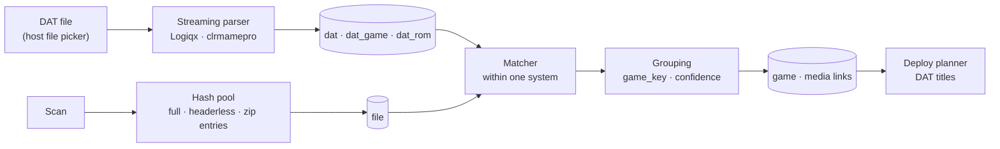

Identify uses no network. It never writes to the library.

Identify matches the catalog's files to the imported DATs (`packages/engine/src/identify/`). It
reads the catalog and, for a few files, the library; it never writes, moves or renames anything
in the library. The facade (`engine.identify`, `identify/api.ts`) runs one job at a time:
`run()` is refused with `IdentifyBusyError` while a DAT import or another run is in progress,
and importing, removing a DAT or deciding review items is refused while a run is in progress.

**The lock.** Each library is identified under its `identify` work lock (see
[One work lock per library](#one-work-lock-per-library)). A run of one library that another job
holds is refused with `LibraryBusyError` and starts nothing. A run over every library goes in
library id order; a library another job holds gets a `busy` summary, nothing of it changes (a
stopped run's phase and cursor, or a complete run's summary, stay as they were), and the run
goes on with the next one.

**After a scan.** The desktop host (`apps/desktop/src/main/identify-host.ts`) identifies a
library on its own once its scan completes and a DAT is imported. A library whose scan
completes while a run (or an import) holds the facade waits, once, and is identified when that
run ends, so a rescan of several libraries identifies each of them in turn.

**Phases.** `identifyRoot` (`identify/job.ts`) runs four phases in order:

1. **rehash** re-reads only the files whose hashes are not enough yet: present, hashed files
   written by an older hasher (`hash_version` below `HASH_VERSION`) in a system with header
   rules, or zips that may hold 2 to 64 entries, in a system with at least one ready DAT, and
   only when no full hash already matches a DAT rom of their system. A system's files are
   re-read once a DAT for it is imported (the import moves the generation). A re-read whose bytes differ from the scan's (the sha1, or a zip's
   whole-file sha1) is counted as changed since the scan and left for the next scan. A failed
   read leaves the file's match exactly as it was and counts as not evaluated; if the library
   folder is then gone, or 20 reads in a row failed, the run ends `could-not-finish`.
2. **match** applies the matcher to every hashed present file, and to unreadable files (by name
   only), 1,000 files per transaction. A playlist that joined a DAT game is left alone: only
   the group pass judges it.
3. **group** re-reads every `.m3u` without a DAT match and joins it to the DAT game of the discs
   it lists. A playlist already grouped that no longer joins its discs goes back to its filename
   game; one whose read fails keeps exactly the grouping it had (a cancel before this phase
   does too). A playlist is read capped at 64 KiB, read-only and never through a symlink where
   the OS has the flag; only names in the playlist's own folder are followed. Then the games'
   confidence is recomputed and games left without a file are dropped.
4. **link-media** links artwork to the games their files are in now.

**Progress** goes out at most every 100 ms within a phase (`PROGRESS_INTERVAL_MS`, as for the
scan and the card writer), on every phase change, and at the end of each phase, so a large
library sends a few messages a second, not one per file.

**A stop part-way.** A run that is cancelled or cannot finish after matching began recomputes
the library's confidence, drops games left empty and links artwork again before it records its
summary, so the counts, badges and covers agree with the files it did match.

**Unhashed files are skipped.** A file a scan listed but has not hashed yet is never matched,
not even by name: it is counted as not checked (`IdentifySummary.notChecked`, the same count as
`HealthSummary.uncheckedFiles`) and is identified by the first run after a scan hashes it.

**Resume.** `identify_run` (one row per library) records the phase and the cursor (the last
file id done) after every page. A run that was cancelled, could not finish or died resumes at
that phase and cursor, provided the DAT generation has not moved since; otherwise it starts
over at rehash.

**Generations.** `dat_generation` moves on every DAT import, replace and removal. A run that
completes stores the generation it ran against as `complete_generation`; a run that does not
complete leaves it unchanged. `identify.health().staleRoots` lists the libraries with present
files whose last complete run predates the current generation, once any DAT is imported.

**Removing or replacing a DAT** reverts every file that DAT matched (and every playlist that
joined one of its games) to its filename game, in the same transaction that deletes the DAT, so
a failure leaves both as they were. Artwork follows the files to their games in the same
transaction. No reason that depended on the DAT survives: files whose hash it placed in its
console (`other-system`) and, when it was that console's last ready DAT, the console's files it
did not list (`not-in-database`) become not identified yet. The next identify matches those
files again.

**Review decisions.** Accepting keeps a match and takes the file off the review list. Rejecting
adds the DAT game's key to the file's `rejected_keys` (a JSON list, never shortened, migration
14) and matches the file again without any of them, under every rule: the next candidate, or
its filename game once every candidate is rejected (it then leaves the review list). Artwork
follows the file in the same transaction.

## Getting game databases

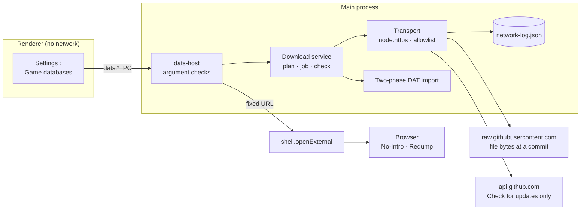

Settings › Game databases offers two ways to get a DAT
([ADR 40](decisions.md#40-game-databases-can-be-downloaded-from-one-pinned-source-only-when-asked)).

**From the official site.** The page names a site (`no-intro` or `redump`), never a URL; the
host (`apps/desktop/src/main/dats-host.ts`) maps it to a fixed URL and hands it to
`shell.openExternal`, so the user's browser downloads the file under the site's own terms.
Romperoom makes no request of its own for this. "Import a DAT file" then opens the existing
picker in the Downloads folder and preselects the newest `.dat`, `.zip` or `.xml` modified since
the page was opened, where the platform supports that (macOS: not measured yet).

**Download for me.** The download service (`main/dat-download/service.ts`) works from a listing
of libretro-database's `metadat/no-intro` and `metadat/redump` folders at one commit: the
listing shipped in `packages/profiles/data/libretro.json`, or the later one a "Check for updates"
stored in `<dataDir>/libretro-pin.json` (the later commit date wins). A plan needs no request.
A job runs only against the commit the user reviewed, one file at a time: the file is streamed
into a temporary folder under `<dataDir>/downloads/`, its size and git blob SHA-1 are checked
against the listing, and it goes through the same two-phase import as a picked file, with an
explicit source label and a `dat_origin` row. The folder is then removed, whatever the
outcome. "Check for updates" asks `api.github.com` for the branch head (one request) and, only
when it moved, for the two folder listings (three in all).

**The transport** (`main/dat-download/transport.ts`) is the only code that opens a socket.
It uses `node:https` from the main process, so the renderer's guards (CSP, the dead proxy, the
host resolver rules and the WebRTC policy; see [security.md](security.md#network-isolation))
are unchanged. Every URL passes the allowlist (`allowlist.ts`: two exact hosts, fixed path
shapes, the commit in the path) and every resolved address the address guard (`address.ts`) before
a connection is made. Redirects are refused, sizes and times are capped, and no credential or
cookie is ever sent. Every attempt is appended to `<dataDir>/network-log.json` (the newest 500),
which Network activity shows. Nothing calls the transport on boot, on a timer or after a scan:
only "Download N files" and "Check for updates" do.

## Deploy planner

`packages/engine/src/deploy` plans a device package: which files go where on an SD card, and
how many bytes that takes on the card. It writes nothing: the [card writer](#card-writer) does.
The desktop's deploy host (`apps/desktop/src/main/deploy-host.ts`) drives both for the card
wizard, so the page never names a path ([decisions.md](decisions.md), ADR 18, and
[security.md](security.md)); the engine object exposes them
(`planDeploy`, `getDeployPlan`, `discardDeployPlan`, `listProfiles`, `setBiosFolder`,
`listVolumes`, `deployPlan`, `cancelDeploy`).

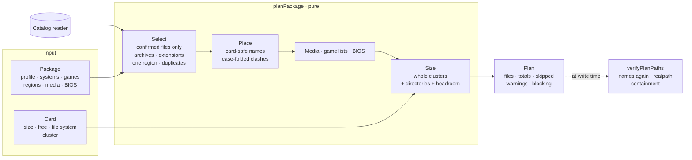

- **Only confirmed files.** The reader uses the catalog's confirmed-file rule (a present file a
  complete scan verified). A game with any unconfirmed file is left out whole
  (`unconfirmed-files`), so a region preference falls through to the next region rather than
  copying half a game.
- **Identified titles.** A game's name on the card is `COALESCE(display_title, title)`: once
  identify links a file to a DAT game, that row's title (its description, else its name, minus
  the region and revision tags) is what the gamelist shows, with no deploy-side lookup. The reader also groups
  games of one system, title and region into one card entry (`CatalogGame.memberIds`), exactly
  as M1 grouped them before stable game identity split two DAT revisions into two rows: so
  `onePerGame` still keeps the newer revision, and selecting a game by any of its member ids
  (`PackageDef.selection.gameIds`) selects the whole merged entry.
- **Selection order.** Archive and extension rules run first, then one region per title (by the
  package's region order, default USA, Europe, Japan, World; a game tagged with several regions
  ranks by the best of them; ties by region name, then catalog id), then byte-identical
  duplicates. A game that could not be hashed is never a duplicate. Before the region order, a
  region with every disc of the title beats one missing a disc ("every disc" is the total a
  `(Disc 1 of 3)` tag states, else every disc any region of the title has; a one-disc game is
  whole). When no region has them all, the best region goes and a warning names its missing
  discs. A disc the library has is never dropped without a word: whatever revisions, playlist
  or missing disc the set has, every disc of the chosen region is on the card (its newest copy)
  or named in a warning, and no warning names a disc that is there (a seeded property test in
  `deploy.test.ts` checks it over 2,500 generated sets). A gap in the numbering of a set with
  no `of N` tag is not known to anyone, so it is not warned about.
- **One clean release.** Within a game, files are grouped into releases by name with any
  part tag (`Disc`, `CD`, `Side`, `Track`, `Part`) set aside, so a multi-disc set stays whole. A
  finished release beats a bad dump (`[b]`) and a Proto, Beta, Demo, Sample, Unl or Pirate one;
  then one with every disc its tags state (a release that holds only some of the set's discs,
  such as an older copy of one disc or a lone playlist, ranks by the discs it lacks and so
  never outranks the release that keeps the rest); then the highest revision wins (`Rev 2`, `v2` or
  `Rev B` over `Rev 1` over none; `(Vietnam)` is not a revision), then the later numbered stage
  (`Proto 10` over `Proto 2`), then the file name. Copies that differ only in a revision tag are
  one release when they name discs, each disc from its newest copy: `(Disc 1) (Rev 1)` beside
  `(Disc 1)` and `(Disc 2)` copies Disc 1 (Rev 1) and Disc 2. Such a mixed set leaves out the
  playlist (it names the older discs) and says so. A game that only exists unfinished is
  copied with a warning. Byte-identical files under one game keep the one with the shortest
  path (then the first by name).
  A zipped game goes only where the profile says the system reads archives
  (`acceptsArchives`, else the extension list); nothing is extracted.
- **Names on the card.** Every segment is NFC, has control and bidi characters removed,
  FAT-illegal characters and backslashes replaced, no trailing dot or space, no leading dot, no
  Windows device name, and fits 255 UTF-16 units and 255 UTF-8 bytes with the extension kept.
  Paths are claimed case-folded and NFC-folded. When one-file games would land on the same
  card name, every one of them gets a suffix keyed to its own file (the first six hex digits of
  its SHA-1, else of a hash of where it lives: `Game (3fa9c1).nes`), so adding or removing one
  twin renames none of the others; a game left alone with its name gets the plain name.
  A multi-file game (a cue sheet and its tracks) cannot be renamed, so a clash leaves it out
  (`name-collision`). BIOS files are never renamed: a BIOS the card would rename is left out.
- **Bytes on the card.** Each file takes whole clusters. The cluster comes from the target, or
  from the Windows default for the card's size and file system (FAT32 and exFAT tables, binary
  units); when neither is known the largest default is assumed, with a warning. Directories
  are counted too: their entries (FAT long names in 13-character slots, exFAT in 15), rounded to
  clusters. Two percent of the card stays free. The plan blocks when the package plus the
  headroom exceeds the free space; an exact fit passes. Card presets are decimal (a "64 GB"
  card is 64,000,000,000 bytes).
- **File-size limit.** FAT32 holds at most 4 GiB - 1 bytes per file. A larger file leaves its
  game out (`too-large`), or keeps it with a warning when the package asks for that. A profile
  that needs FAT32 blocks a plan for an exFAT card.
- **Media and game lists.** Media goes where the profile's template says, named after the ROM,
  in the formats the profile reads (`.jpeg` is written as `.jpg`). Images are copied at full
  size: resizing is not built. ES-DE and Batocera game lists are generated, one per system,
  naming only media in the plan. Other formats are listed as not written yet.
- **Deterministic.** The same catalog and arguments give the same plan, file for file, whatever
  order the catalog returns rows in. A 10,000-game plan takes well under two seconds.
- **Kept plans.** `planDeploy` returns a summary and keeps the full plan in memory under a
  random id: at most four, each for 30 minutes.

The write-time check is in [security.md](security.md#deploy-containment).

## Card writer

`deploy/volumes.ts` lists the mounted volumes and judges which may take a package;
`deploy/writer.ts` writes a kept plan to one of them, or to an export folder. The engine's
`deployPlan(planId, target, options, onProgress)` joins the two: one deploy at a time,
cancellable with `cancelDeploy()`, and refused when the volume listing fails.

**Volume listing.** Each OS's own listing command, run with `execFile` (no shell, fixed
arguments, a timeout and an output cap): `diskutil list -plist` and `diskutil info -plist` on
macOS (read by a small plist reader that refuses entity declarations), a fixed PowerShell
script on Windows (`Get-Partition`, `Get-Volume`, `Get-Disk`, mapped network drives), `lsblk` and `findmnt` JSON on Linux. Free space and the cluster
size come from `statfs`. A listing that fails is `{ ok: false, reason }`, never an empty list.
The Windows and Linux readers are tested from recorded fixtures only.

**Safe-target rules** (`checkSafeTarget`), each a refusal with a code: not mounted, unreachable,
the system disk or a system volume, a protected path (a file system root, the home folder or
a folder holding it, the temp folder, a folder of mounts like `/Volumes`, anything inside a
system folder), read-only, a network volume (unless confirmed), a fixed disk (unless
the user types its name), too small for the plan plus headroom, and any volume that holds or sits
inside a library root, a BIOS folder or the app's data folder. Paths are compared after
`realpath`, case- and Unicode-folded.

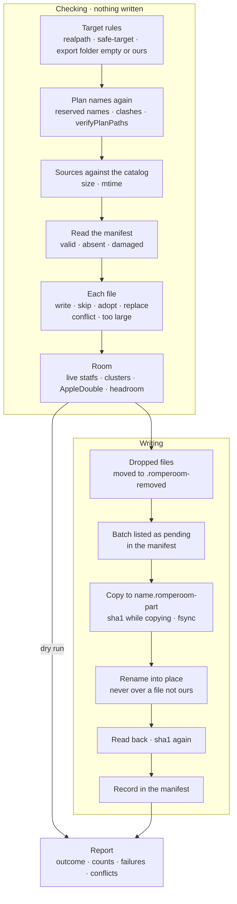

- **Outcomes:** `complete`, `partial` (some files failed or conflicted, the rest are done),
  `dry-run`, `refused` (nothing was written), `cancelled`, `card-full`, `card-unavailable`,
  `library-unavailable` and `card-error` (an unexpected error after the first write, or 25 card
  errors in a row: the manifest is saved once more and the report comes back in full). Progress reports a phase (`checking`, `removing`, `writing`,
  `finishing`, `done`), files and bytes, at most every 100 ms plus a final event.
- **Ownership.** A file on the card is the writer's only when the manifest lists it with the
  same size and modification time, or the same SHA-1 (a FAT card keeps local time, so a
  time-zone change moves every mtime). An identical file it did not write is adopted. Anything
  else is the user's: a conflict, left alone, unless `overwriteUnmanaged` moves it aside first.
  Modification times are whole milliseconds, floored from the nanosecond stat in the scanner
  and the writer alike; values from older catalogs match within 1 ms.
- **Game lists the frontend edited.** An owned `gamelist.xml` that changed on the card (play
  counts, favourites) is kept: the plan's `<game>` entries it lacks, matched by `<path>`, are
  added before its last `</gameList>`, and the record is marked `frontendEdits` so later runs
  add to it rather than replace it.
- **Another profile's card.** When the manifest's `profileId` differs from the plan's, the
  files it owns are held (identical ones skipped, others conflicts, dropped ones left) unless
  `confirmProfileSwitch` is set; the report says so in `previousProfile`.
- **Nothing is overwritten in place.** A copy goes to `<name>.romperoom-part`, created with
  `wx`; it reaches its final name by a no-clobber rename (a reservation made with an exclusive
  create, then a rename onto it) or, for its own file re-checked just before, a plain rename.
  A partly written file never has a final name. The read-back hashes the placed file again; a
  copy that differs is removed and reported.
- **Removal is a move.** Files the plan no longer has, inside the profile's folders, are moved
  to `.romperoom-removed/<time>/` on the same card. `eraseRemoved` deletes them instead, only
  after a fresh hash shows they are still exactly what was written. Empty folders the writer
  made are removed at the end.
- **Interruptions.** Cancel, a full card or a library that stops answering ends the run with the
  part file removed and the manifest saved as `stopped`. A card that goes away ends it as
  `card-unavailable` without touching it further. The next run finishes the work: a part file
  is removed only if the last valid manifest listed it as pending, and an empty file at a final
  name only if the manifest's `reserved` list names it (with its device and inode when known).
  `EBUSY` and `EPERM` are retried three times with backoff, then reported for that file only.
  After the first write, any other error ends the run as `card-error` with the report so far.
- **FAT32.** The 4 GiB - 1 byte limit is checked again against each source's real size. On macOS
  every written file and folder gets a 4096-byte AppleDouble `._` file beside it; the room
  estimate counts them.

### The manifest

`romperoom-manifest.json` at the card root (or export folder). It is written to
`romperoom-manifest.json.romperoom-part`, synced, then renamed over the old one. It is read with
a 64 MiB cap and a strict schema; a damaged one makes every file on the card the user's, and is
itself moved aside. One that is ours with a higher `schemaVersion`, or ours with nothing wrong
but fields this version does not know, came from a newer Romperoom: the deploy (dry run too) is
refused with "update the app", and nothing on the card changes.

| Field           | Meaning                                                                 |
| --------------- | ----------------------------------------------------------------------- |
| `schemaVersion` | `1`.                                                                    |
| `tool`          | `"romperoom"`. With `schemaVersion` it starts the file, as a signature. |
| `toolVersion`   | The writer's version.                                                   |
| `planId`        | The plan last written.                                                  |
| `profileId`     | The device profile it was written for.                                  |
| `state`         | `writing`, `complete` or `stopped`.                                     |
| `updatedAt`     | When it was saved (ms since the epoch).                                 |
| `files`         | One entry per file the writer owns (below).                             |
| `dirs`          | Folders the writer created, removable once empty.                       |
| `pending`       | Files being written now: their `.romperoom-part` files are the writer's. |
| `reserved`      | Final names an empty reservation may sit at (`toRel`, `dev`, `ino`).    |

Each `files` entry: `toRel` (a `/`-separated path under the card root), `size`, `sha1`, `kind`
(`rom`, `media`, `gamelist` or `bios`), `sourceGameId`, `writtenAt`, `mtimeMs` (the card's
time for the file right after writing), `sourceMtimeMs` and `sourceBytes` (so an unchanged
source is skipped without hashing it again), and `frontendEdits` on a game list the frontend
changed.
