# Using Romperoom

Romperoom shows your ROM collection as a shelf of games, copies the games you pick to an SD
card, and tidies up duplicates and leftover artwork. Only Tidy up changes your games, and only
after you have seen what it will do; cover art only adds pictures to Romperoom's own folder,
when you ask. This guide walks through every screen.

The pictures come from a small made-up test library, so the sizes are tiny and most games have
placeholder covers.

## Contents

- [Before you start](#before-you-start)
- [Set up your library](#set-up-your-library)
- [Folders that need a console](#folders-that-need-a-console)
- [Browse your games](#browse-your-games)
- [Game details](#game-details)
- [Library health](#library-health)
- [Cover art](#cover-art)
- [Getting game databases](#getting-game-databases)
- [Identify your games](#identify-your-games)
- [What the labels mean](#what-the-labels-mean)
- [Check name matches](#check-name-matches)
- [When folders look empty or gone](#when-folders-look-empty-or-gone)
- [Files that couldn't be read](#files-that-couldnt-be-read)
- [Settings and themes](#settings-and-themes)
- [Put games on an SD card](#put-games-on-an-sd-card)
- [Tidy up your library](#tidy-up-your-library)
- [Keyboard](#keyboard)
- [Gamepad](#gamepad)
- [Questions](#questions)

## Before you start

- Your games can be on this computer, an external drive or a network share (NAS). Connect the
  drive first.
- Romperoom works best when each console has its own folder, such as `snes` or
  `Game Boy Advance`. Folder names are matched to [known systems](systems.md) without minding
  case, accents, spaces or punctuation.
- Zipped games (`.zip`, `.7z`) are fine.

## Set up your library

The first time you open Romperoom, it asks for your ROM folder. Press **Choose your ROM
folder** and pick the folder that holds your console folders.

Romperoom then counts your games in two steps. First it finds them: every game is in your
library within minutes, even on a NAS. Then it reads every file once to fingerprint it (a
hash), which is how it spots exact copies; on a NAS that can take hours for a large collection.
While it checks, press **Go to my library** to start browsing: checking carries on in the
background, and Health says how many files are still waiting. You can press **Cancel scan** at
any time. A later scan skips the files it has already read, so it picks up close to where it
stopped.

| Light                                                           | Dark                                                                 |
| --------------------------------------------------------------- | -------------------------------------------------------------------- |
| 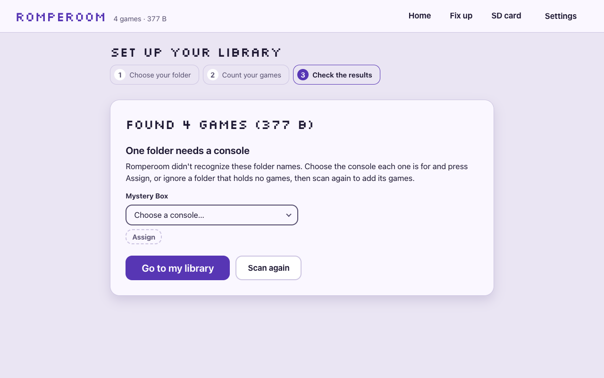 | 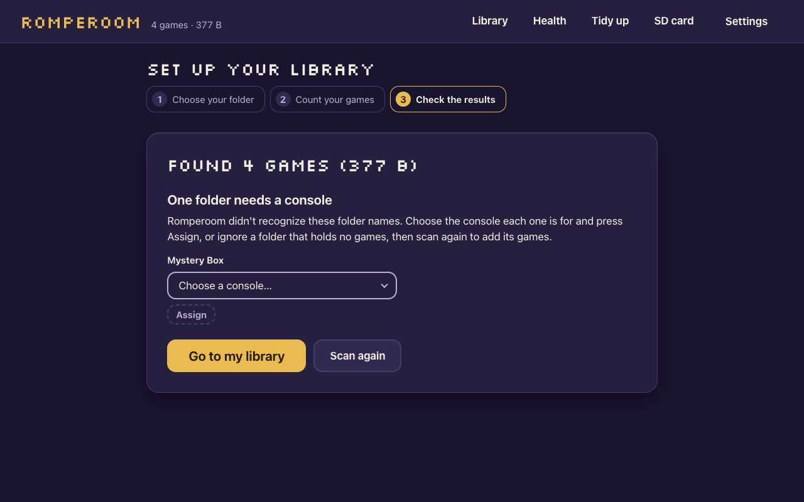 |

When the scan finishes, you see how many games it found. Press **Go to my library**. If the
folder had no games, choose a different folder.

## Folders that need a console

If a folder's name doesn't match a console, Romperoom asks you which console it is. Pick one
from the list and press **Assign**. Nothing is assigned until you press it, so you can't change
a folder by mistake while moving through the list. If a folder isn't games at all, choose
**Not a console — ignore this folder** and press **Ignore folder**. Ignored folders are listed on
Health, where **Include again** brings one back.

Each assignment can be undone under **Recently assigned**. Press **Scan again** afterwards to
add the games in the folders you gave a console.

| Light                                                                          | Dark                                                                                |
| ------------------------------------------------------------------------------ | ----------------------------------------------------------------------------------- |
| 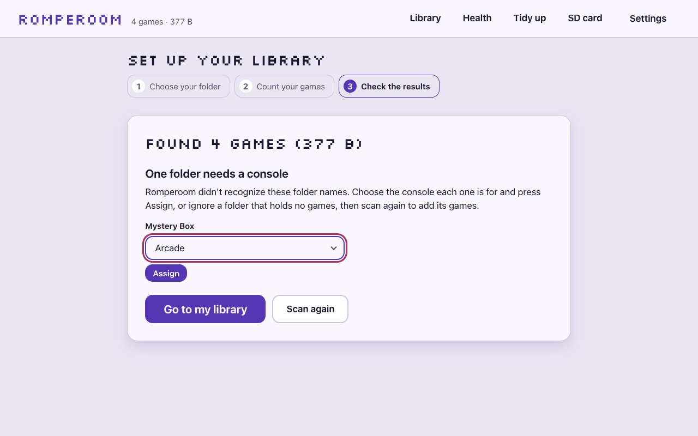 | 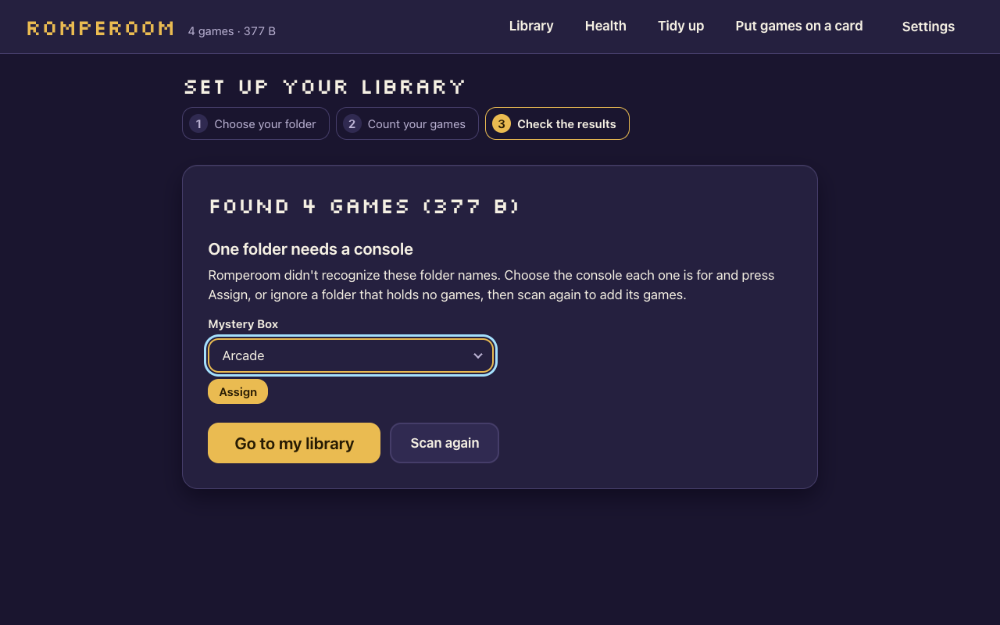 |

## Browse your games

**Library** shows every game as a cover on a wall.

- The row of consoles along the top filters the wall. **All games** shows everything.
- **Search games** filters by title as you type. **Clear search** empties it.
- **Sort by** orders the wall by **Title** or by **Size**.
- Games without cover art get a placeholder with their initials.

The same game in two regions, such as USA and Europe, shows as two covers.

| Light                                                       | Dark                                                             |
| ----------------------------------------------------------- | ---------------------------------------------------------------- |
| 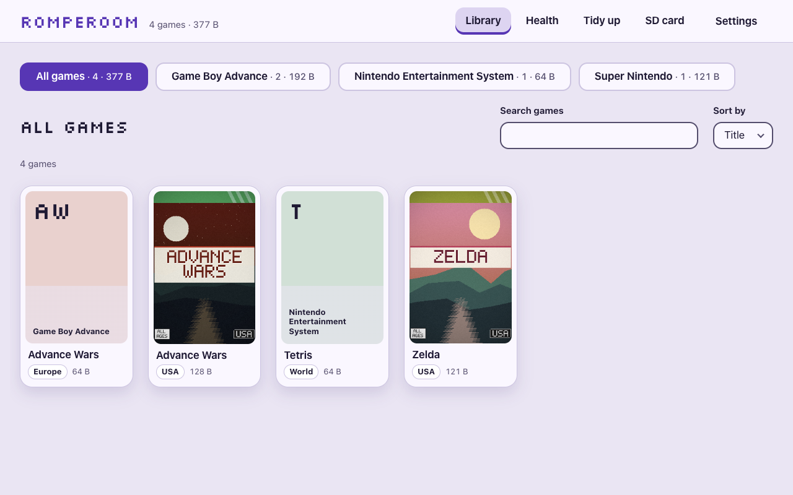 | 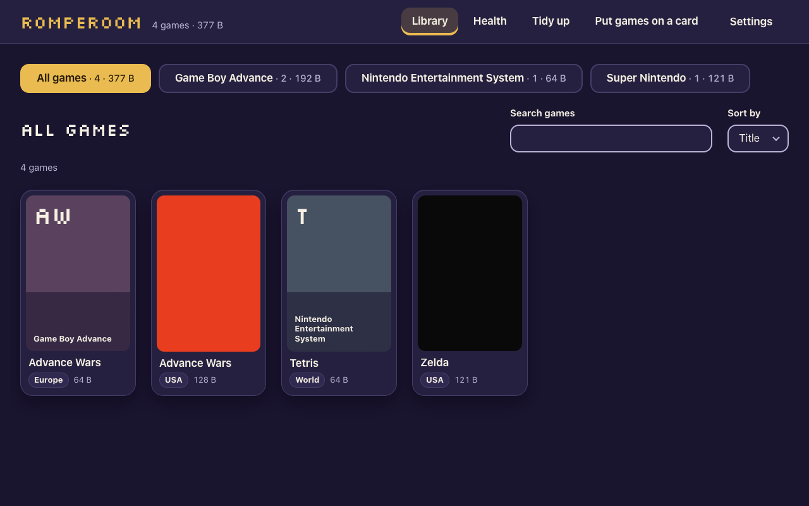 |

## Game details

Select a cover to open its details: the console, the region, whether the game is identified,
how many files it has, its size on disk, its size unzipped, and its cover art. When the game has
a screenshot or a title screen, **Screens** shows them side by side. Close the panel with its
close button or Escape.

**Identified** is one of the three labels in [What the labels mean](#what-the-labels-mean).
**Identified by** names the game database and version that matched it, and that database's own
title for the game (which can differ from the file name). Some databases, such as FinalBurn
Neo's, file games under a short code; that code is shown too, as "DAT entry". It says "Not
identified yet" until you import a database and identify (see
[Identify your games](#identify-your-games)).

| Light                                                           | Dark                                                                 |
| --------------------------------------------------------------- | -------------------------------------------------------------------- |
| 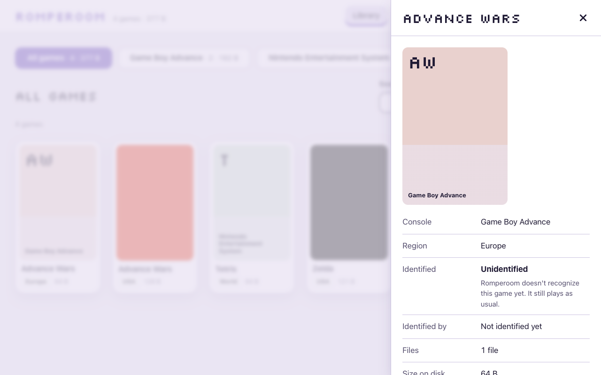 | 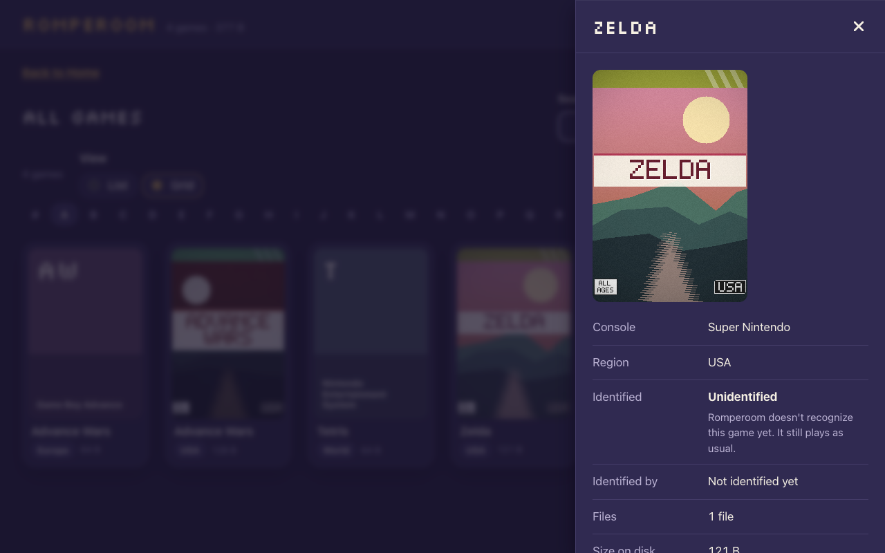 |

## Library health

**Health** sums up your library:

- **Space used**, by console, and the largest games.
- **Duplicates:** byte-identical copies of the same game in one library and one console.
  **Tidy up…** sets the extra copies aside (see [Tidy up your library](#tidy-up-your-library)).
  It checks each copy first and leaves the files of a multi-file game alone, so it may offer
  fewer than Health counts.
- **Unidentified games**, from the last time you identified (see
  [Identify your games](#identify-your-games) below).
- **Folders without a console**, with a link to choose a console for each one in setup.
- **Files that couldn't be read** (below).
- **Games without cover art**, with ways to fill the gaps (see [Cover art](#cover-art)).

Press **Scan again** after you change your files.

| Light                                                         | Dark                                                               |
| ------------------------------------------------------------- | ------------------------------------------------------------------ |
| 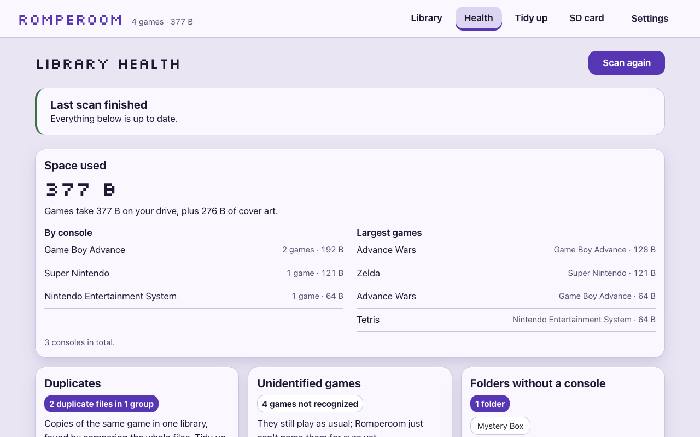 | 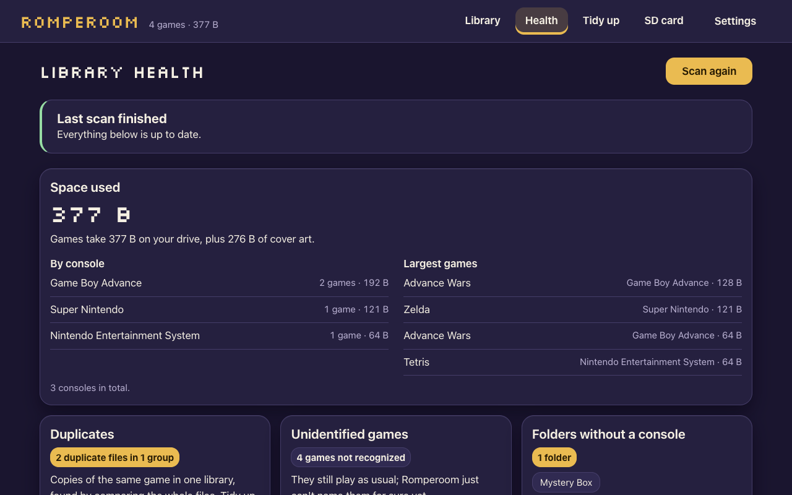 |

## Cover art

The **Games without cover art** card on **Health** counts the games missing a picture, and how
many miss box art, screenshots and title screens. It fills gaps only: Romperoom never replaces a
picture you already have, and goes online only when you press **Get cover art**, and then only
to GitHub.

| Light                                                 | Dark                                                       |
| ----------------------------------------------------- | ---------------------------------------------------------- |
| 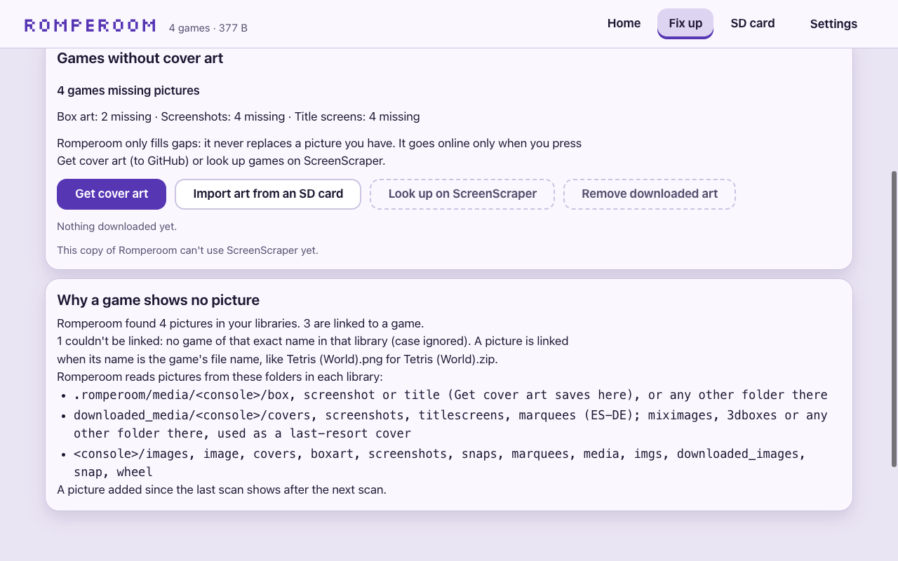 | 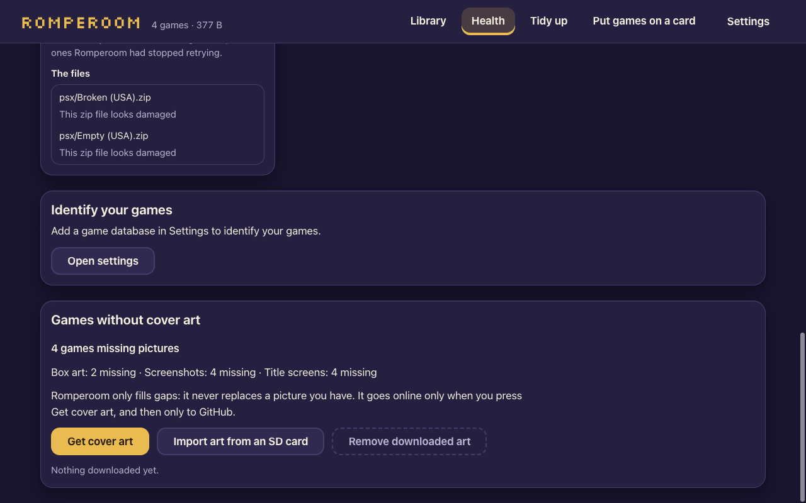 |

**Get cover art** first asks GitHub for the list of pictures for each console with gaps (one request
per console, usually), then shows a review before anything is downloaded: each console with how many
pictures it found, for how many games, how many of those pictures were matched by the game's file
name, their size, and how many pictures are not available (for example "Game Boy Advance: 2 pictures
for 2 games (2 matched by file name) · 138 B · 3 not available"). Each picture not available is one
game and one kind this download can't fill: the collection has no picture by that game's name, or
the game can't take one (see [Troubleshooting](troubleshooting.md#a-picture-didnt-appear)). Then
come the kinds (box art, screenshots, title screens); the total; the source and its terms; and how
many of GitHub's hourly requests the review used and how many are left. Untick any console or kind
you don't want. The terms read: "Pictures from libretro-thumbnails, a community collection used by
RetroArch. The pictures are box and screen images of commercial games; the collection declares no
licence." A console Romperoom can't fetch for (no collection for it, or GitHub's hourly limit
reached) is shown with how many of its games go without ("Super Nintendo: not available for 1
game"), but can't be chosen. Above 2 GB the review warns that the download may take a while; it
never refuses. While a scan runs, **Download** waits for it to finish. **Cancel** backs out without
downloading anything.

| Light                                                                  | Dark                                                                        |
| ---------------------------------------------------------------------- | --------------------------------------------------------------------------- |
| 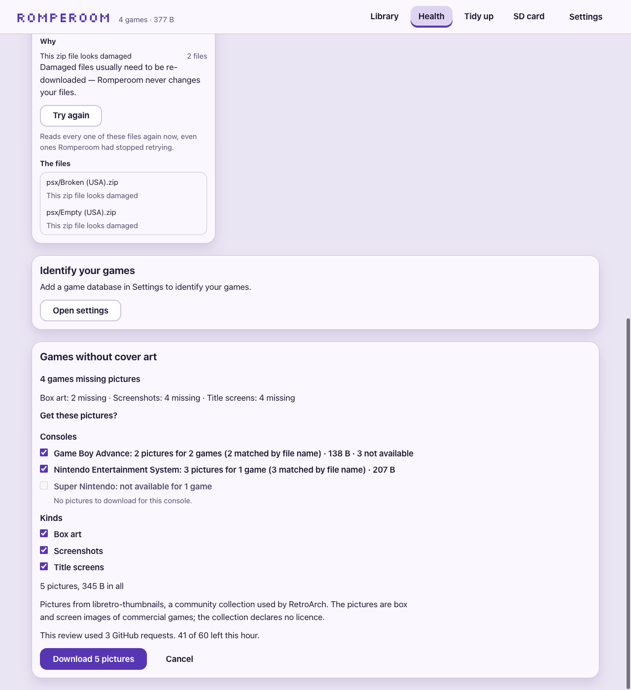 | 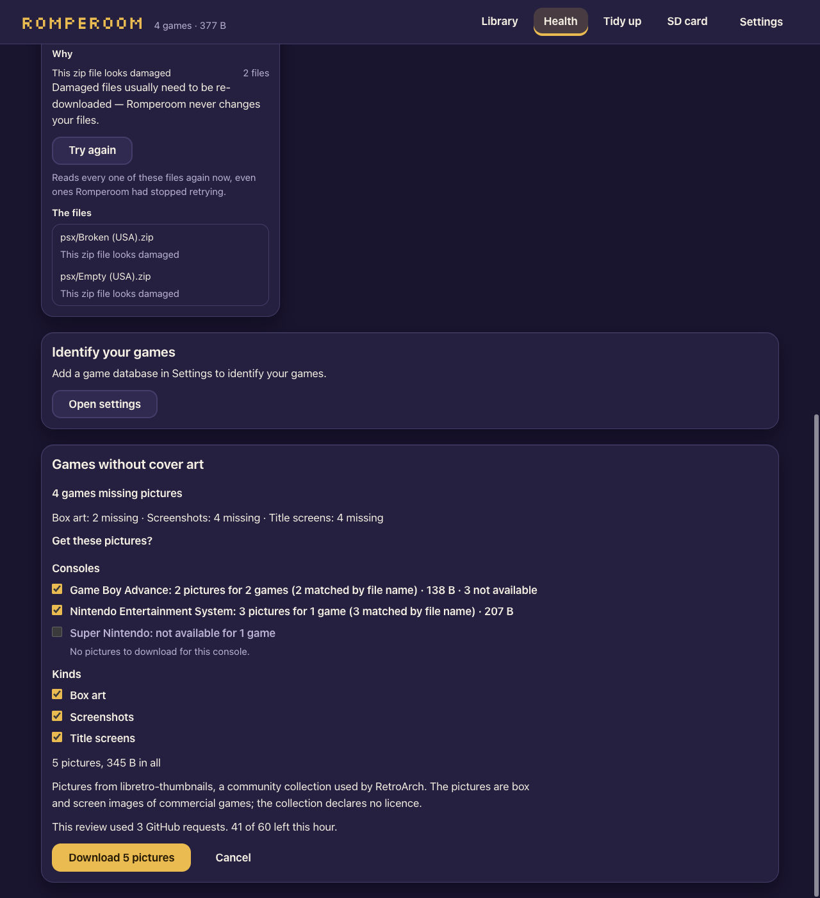 |

**Download** shows its progress picture by picture, with **Stop**: pictures saved before you
press it are kept. The results start with what changed ("Saved 5 of 5 pictures", and how many
failed, if any), then list, for each console you chose, how many pictures were saved, already
present, not available, and any that failed with the reason ("Game Boy Advance: 2 saved, 0
already present, 3 not available"). Not available includes the pictures the review already
counted so, in the kinds you chose; "Saved 5 of 5" counts only the pictures Romperoom tried. The
covers show in the library at once, without a scan.

| Light                                                                 | Dark                                                                       |
| --------------------------------------------------------------------- | -------------------------------------------------------------------------- |
| 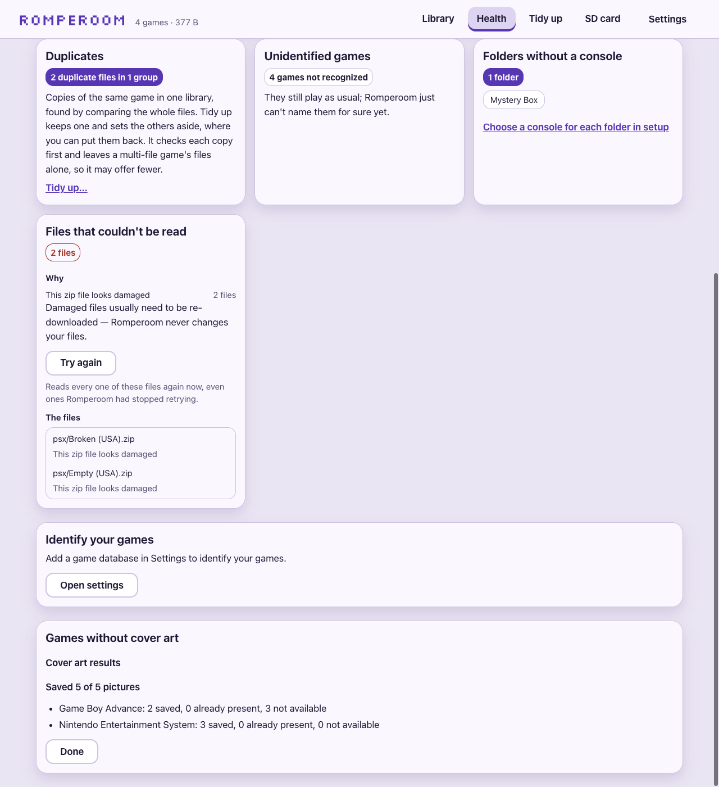 | 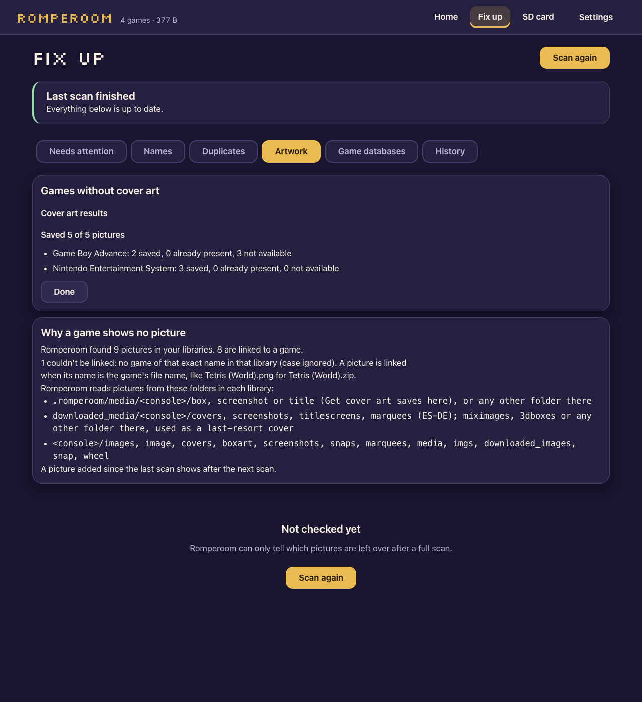 |

**Import art from an SD card** takes pictures from a card you used with a device (choose the
card and the device, as when you put games on a card). Romperoom only reads the card: it reviews
the pictures that fill a gap, per console and kind, and imports the ones you keep. It never adds
a picture for a game that already has that kind.

**Remove downloaded art** deletes the pictures Romperoom added, and only those still exactly as
it saved them; it asks first, in place, saying how many there are and their size. A picture you
changed, or one you added yourself, stays.

Pictures go in your library's own `.romperoom/media` folder, one folder per console and kind.
Each is written first to a temporary folder beside it, `.romperoom/tmp`, and moved into place
once complete. Romperoom never changes your games, and writes nowhere else in your library for
this.

## Getting game databases

Romperoom ships with no game databases (DAT files) of its own. Open **Settings** (top right) and
switch to the **Game databases** tab: it offers two ways to get them, above the list of what you
have already imported.

### Get a database from the official site

Pick a console under **Get a database from the official site** (consoles in your library come
first) and press **Open download page**. Romperoom opens the group's own site in your browser —
[No-Intro](https://datomatic.no-intro.org/) for cartridge-based consoles and handhelds,
[Redump](http://redump.org/) for disc-based ones — and tells you the file name to look for.
Romperoom itself makes no request for this: your browser downloads the file under the site's own
terms.

Once you have it, use **Import a DAT file** in the same section, just below: its own **Console
for the file you import** says which console the file is for (leave it at **Work it out from the
file** and Romperoom reads it from the file itself); once you've just opened a download page, the
picker opens straight to your Downloads folder with the file you got already chosen, where your
system supports that. If Romperoom can't tell the console from the file, it asks you to choose one
before it imports anything — when it has a guess, that guess is already chosen, for you to
confirm. Once an import is done, this console choice goes back to **Work it out from the file**,
so the next file is never tied to the console you chose for the last one.

| Light                                                            | Dark                                                                  |
| ---------------------------------------------------------------- | --------------------------------------------------------------------- |
| 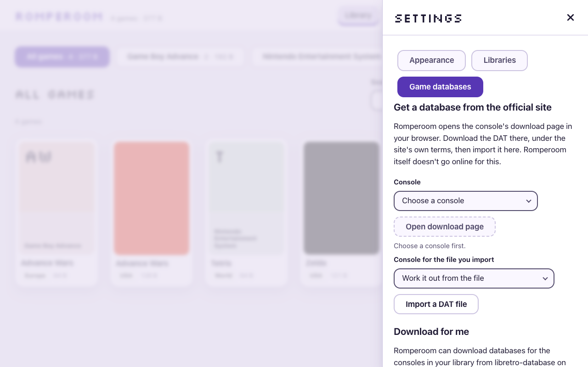 | 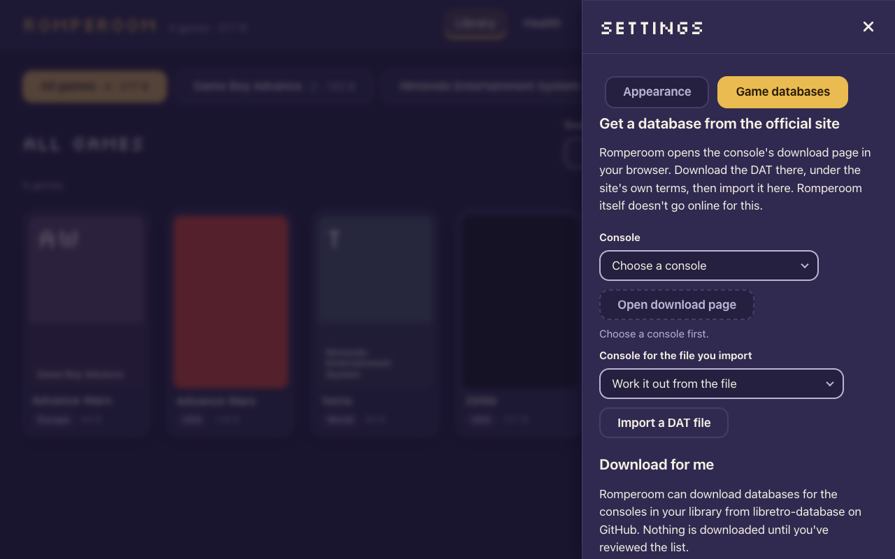 |

### Download for me

Under **Download for me**, press **Review downloads** to see what Romperoom would fetch for the
consoles already in your library, from [libretro-database][libretro-database] on GitHub (a copy
of No-Intro's and Redump's data, converted and shared under the Creative Commons
Attribution-ShareAlike 4.0 licence). Nothing is downloaded until you review the list:
every file, its size, the total, where it comes from and the licence, before you press
**Download**. A console already up to date is shown but can't be chosen again; one with a newer
version is picked for you; one you already have a database for from elsewhere is not picked, and
downloading it replaces that database. **Cancel** backs out without downloading anything.

| Light                                                                     | Dark                                                                           |
| ------------------------------------------------------------------------- | ------------------------------------------------------------------------------ |
| 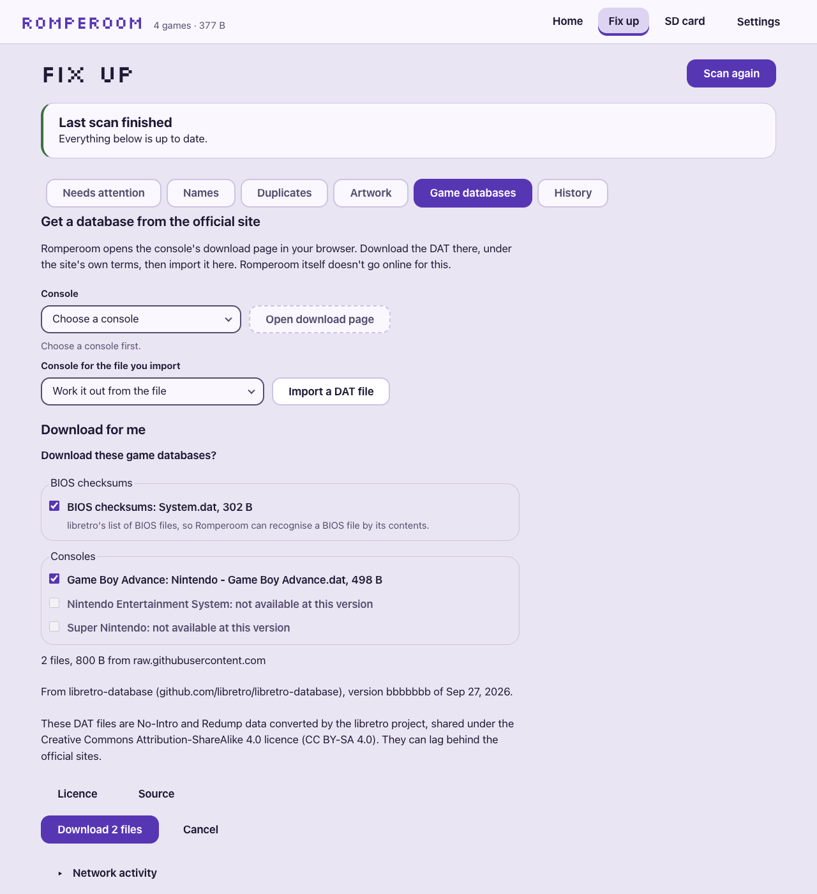 | 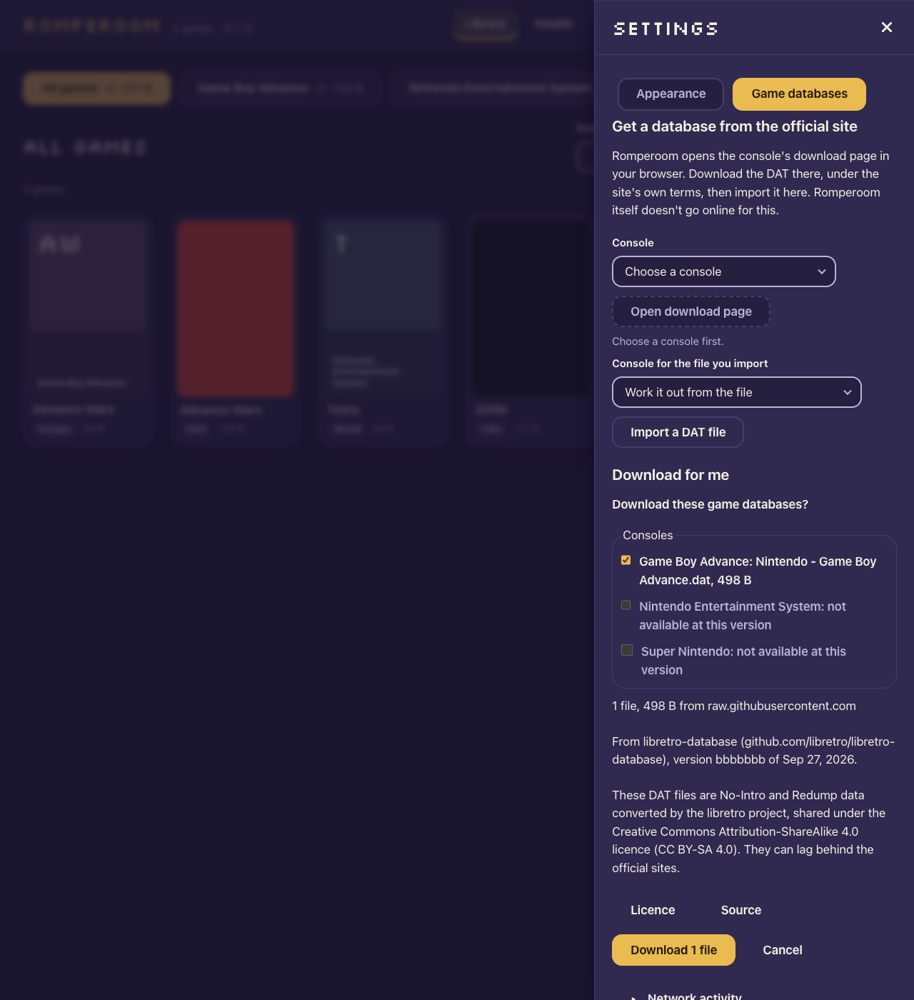 |

While it downloads, Romperoom shows its progress file by file; **Stop downloading** keeps whatever
has already been imported. The results list what happened to each file — imported, replaced,
already up to date, or why one failed — with **Identify now** offered when something changed.

| Light                                                                      | Dark                                                                            |
| -------------------------------------------------------------------------- | ------------------------------------------------------------------------------- |
| 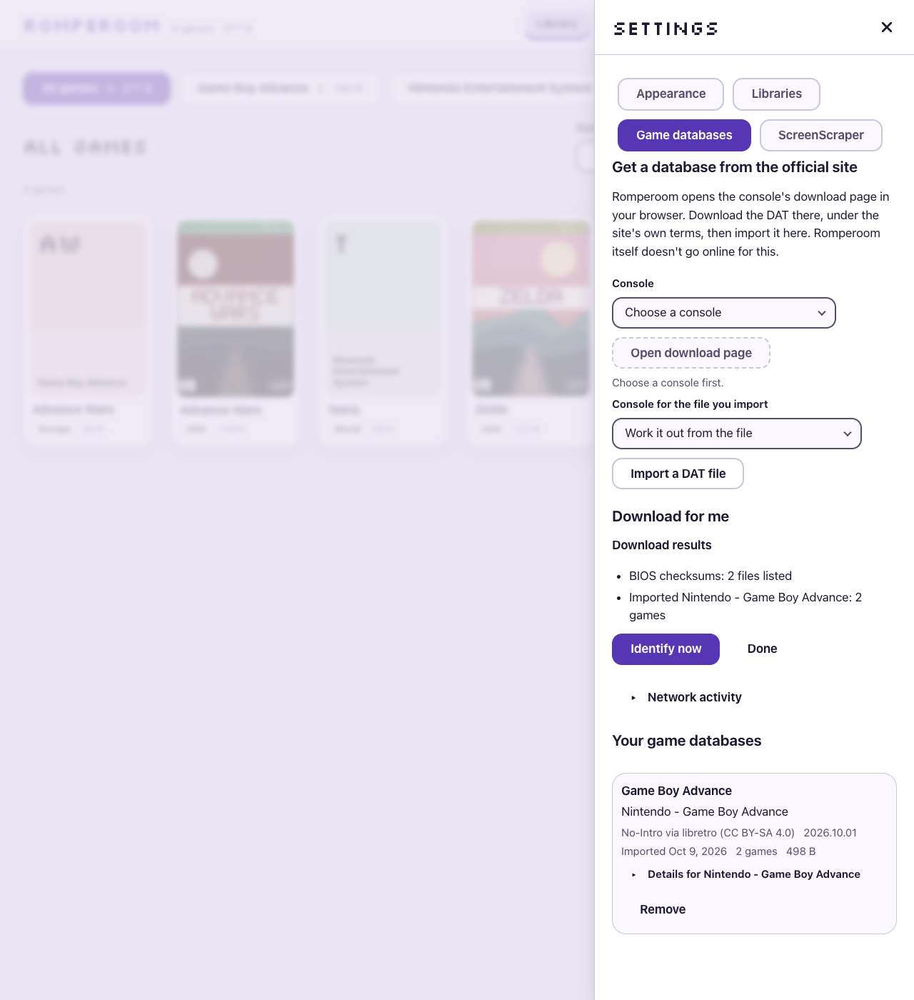 | 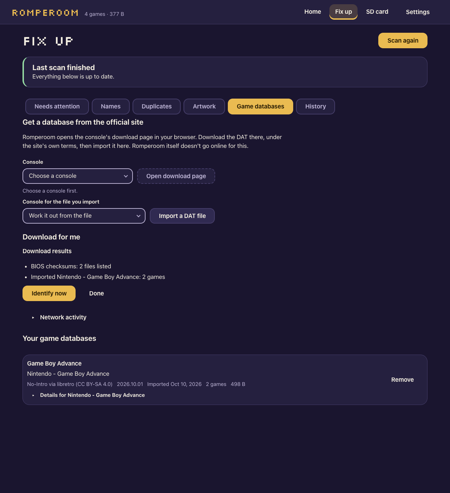 |

**Check for updates** looks for a newer version of libretro-database's listing and says so next
to the button, or says why it couldn't check. **Network activity**, below both sections, lists
every request Romperoom has made for this feature — when, where to, what happened and how many
bytes — so you can see for yourself that it only ever goes to GitHub, and only when you pressed
Download, Check for updates or Get cover art.

### Managing what you have imported

Each imported database is listed below both sections, with its console, its name, where it came
from, its version, the day you imported it, its number of games and its size. A database Romperoom
downloaded for you also has a **Details** disclosure, named with that database (several downloaded
databases are never all just "Details"): the source repository, the commit, the file's address and
a **Licence** link. **Remove** asks you to confirm in place before it takes a database off the
list. Games it had named go back to their file names until you identify again with the remaining
databases.

## Identify your games

Once you have imported a game database, Health shows an **Identify your games** card. Press
**Identify games** to compare every file against the databases you imported for its console. It
shows the phase it is in (reading your games, matching them, grouping discs and versions, then
linking cover art) and how far it has gotten; **Stop** stops it there. Your files are never
changed, but labels it had already worked out before you stopped it stay, with their cover art;
the next run picks up where this one left off.

A scan that finds a game database already imported identifies your library on its own once it
finishes, so you rarely need to press the button yourself after the first time. When you scan
several libraries at once, each one is identified in turn as the one before it finishes.

Identifying never changes the files in your library: it only reads them. When it cannot finish
(the library drive was disconnected, or many files in a row could not be read), it changes
nothing it could not check and says so, rather than showing a count of zero; the next run carries
on from where this one stopped. The card also flags when your databases changed since the last
identify, so you know the labels may be out of date until you identify again.

| Light                                                          | Dark                                                                |
| --------------------------------------------------------------- | -------------------------------------------------------------------- |
| 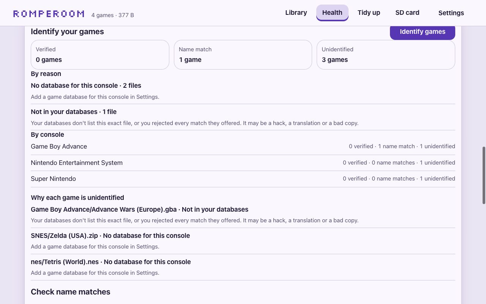 | 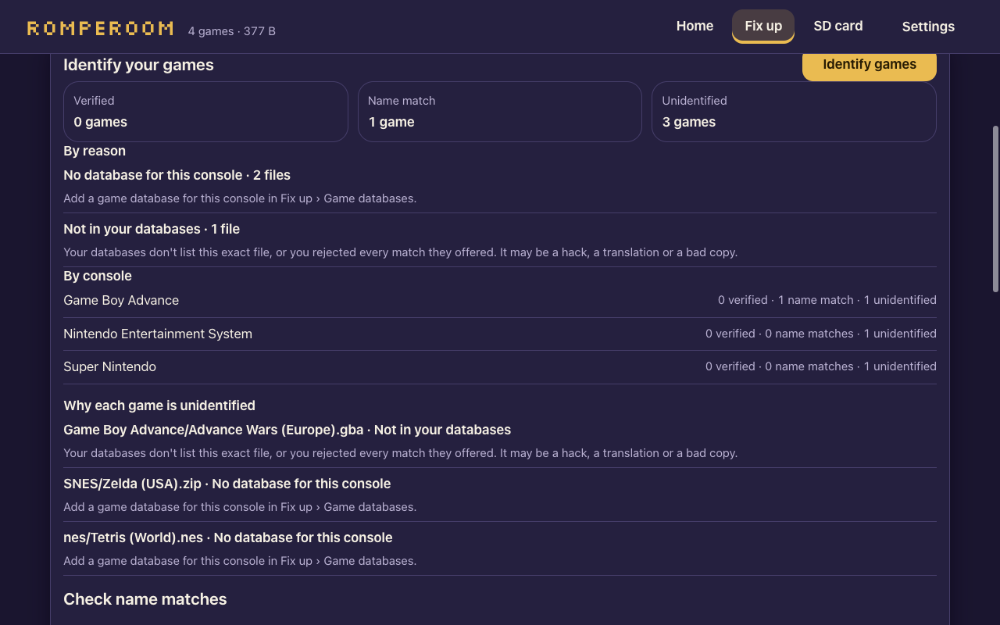 |

## What the labels mean

Identifying says how sure Romperoom is about each game, the same words wherever they appear (the
card above, and a game's own details):

- **Verified:** the file matches a known good copy of the game.
- **Name match:** its name matches a game in your databases, but its contents don't match any
  known copy (it was read and checked, and differs: a hack, a translation, a bad copy or a
  different version).
- **Unidentified:** Romperoom doesn't recognize this game yet. It still plays as usual.

An unidentified file says why:

- **Not read yet:** Romperoom couldn't read this file. Scan again, then identify.
- **In another console's database:** the file matches a game in another console's database. Move
  it to that console's folder to identify it.
- **No database for this console:** you have not imported a database for its console.
- **Not in your databases:** the console's databases don't list this exact file, or you rejected
  every match they offered for it. It may be a hack, a translation or a bad copy.

Files a scan hasn't finished reading yet are skipped; they are identified once a later scan has
read them. Files a scan has read but no identify has looked at since (for example after you
removed a database) are counted as not identified yet: press **Identify games**. **Why each game is unidentified** lists every one of them by name, with its reason (for
"In another console's database", the console it matches).

A verified file the database itself flags as a bad dump still plays, but says so under
**Identified by**: it may not be a clean copy.

## Check name matches

A name match, or a file that matches several games at once, is offered for review on the same
card, named by the database's title and the file it matches. **Accept** it to keep it. **Reject**
asks you to confirm, since Romperoom never offers that pairing again; once confirmed, it tries the
next match, or puts the file back under its own file name once you have rejected every match it
had (the file then leaves the list). **Accept all on this page** and
**Reject all on this page** decide everything currently loaded at once (Reject all asks first,
too). **Show more** loads further matches when there are many.

| Light                                                    | Dark                                                          |
| --------------------------------------------------------- | ---------------------------------------------------------------- |
| 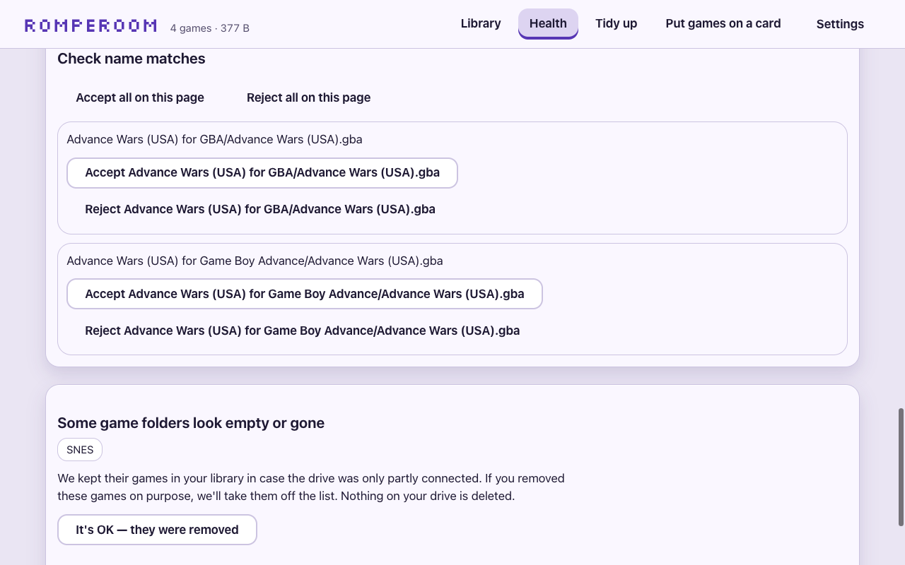 | 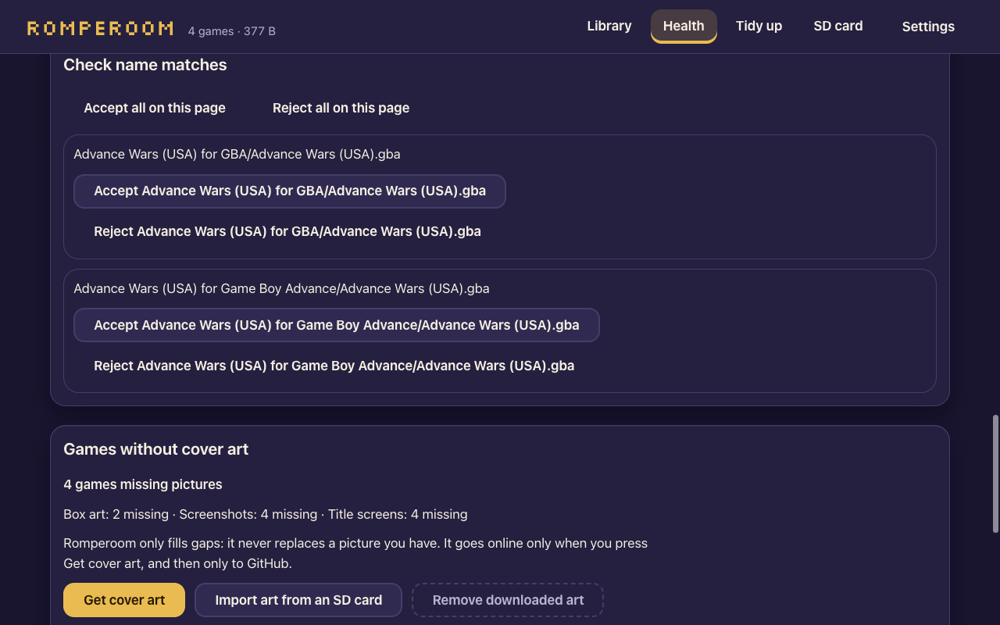 |

## When folders look empty or gone

If a console's folder, or its cover art, seems to have vanished since the last scan, Romperoom
does **not** take those games off your list straight away. A drive that is only partly
connected looks just like deleted games. Instead it shows **Some game folders look empty or
gone** or **Some cover art folders look empty or gone**, with the folders named.

- If the drive was disconnected, reconnect it and press **Scan again**.
- If you removed the games on purpose, press **It's OK — they were removed**. Romperoom takes
  them off its list. Nothing on your drive is deleted.

| Light                                                                           | Dark                                                                                 |
| ------------------------------------------------------------------------------- | ------------------------------------------------------------------------------------ |
| 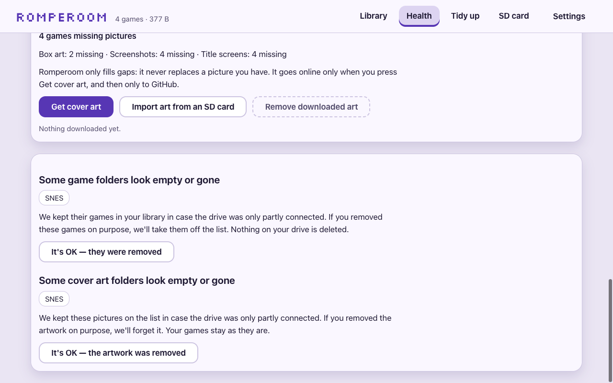 | 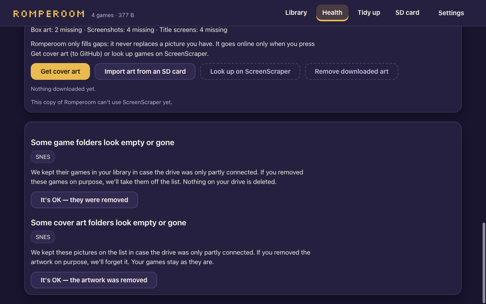 |

## Files that couldn't be read

A damaged zip, a password-protected archive or a drive that stopped answering shows up on
Health with the reason. Damaged files usually need to be downloaded again: Romperoom never
changes your files. Press **Try again** to read every one of them again now.

| Light                                                                          | Dark                                                                                |
| ------------------------------------------------------------------------------ | ----------------------------------------------------------------------------------- |
| 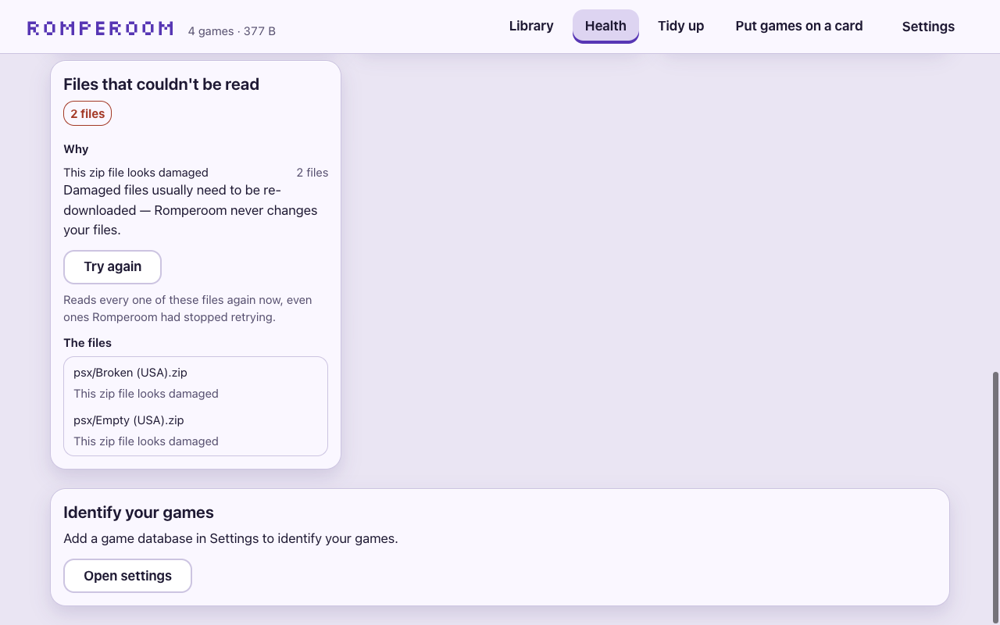 | 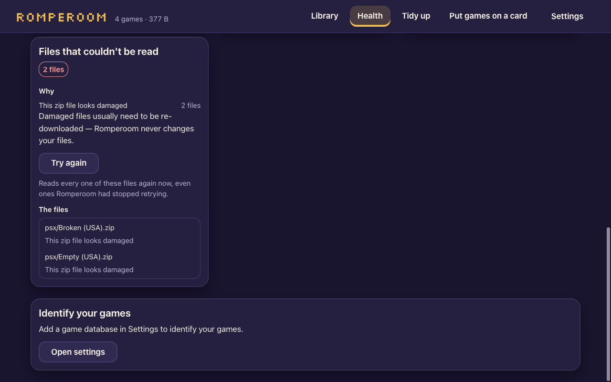 |

## Settings and themes

**Settings** (top right) has two tabs: **Appearance** and **Game databases** (see
[Getting game databases](#getting-game-databases)). Appearance changes how Romperoom looks:

- **Theme:** Console shelf (warm and cosy), CRT neon (glowing arcade colours) or Clean modern
  (quiet, so the cover art stands out).
- **Light or dark:** light, dark, or **Match my computer**.

Your choice is remembered.

| Light                                                     | Dark                                                           |
| --------------------------------------------------------- | -------------------------------------------------------------- |
| 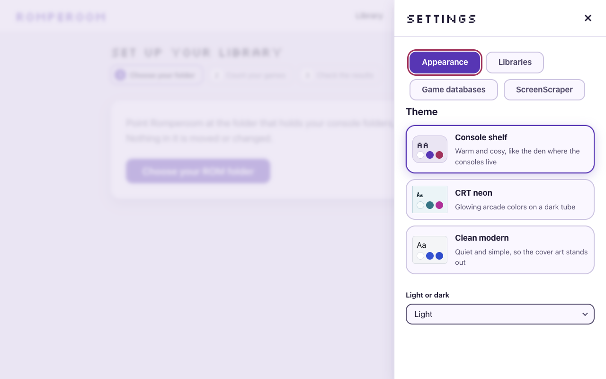 | 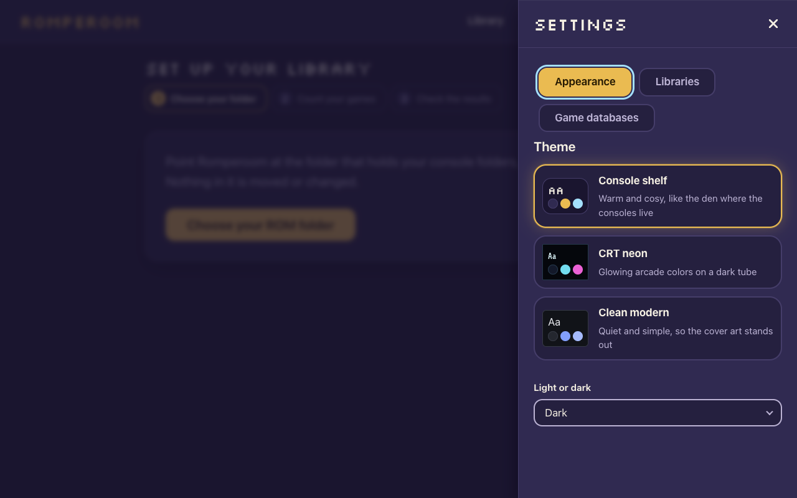 |

| CRT neon, dark                                           | Clean modern, dark                                               |
| -------------------------------------------------------- | ---------------------------------------------------------------- |
| 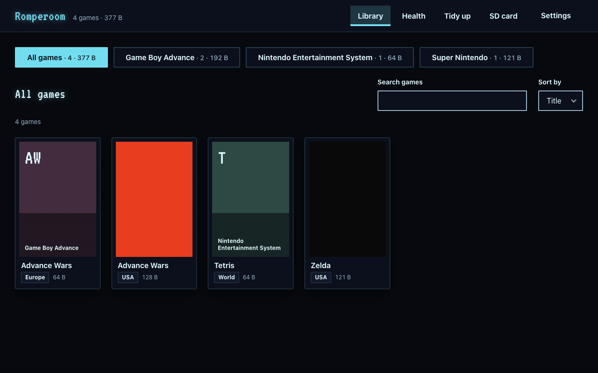 | 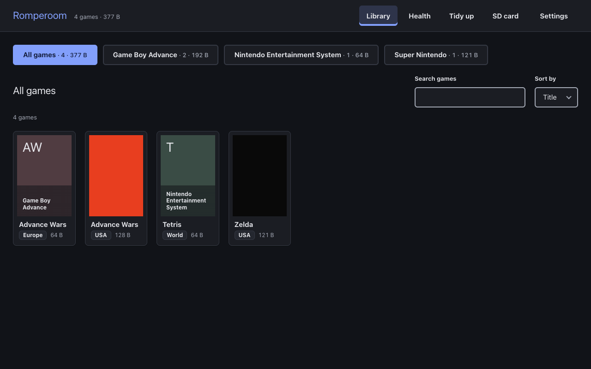 |

## Put games on an SD card

**Put games on a card** in the header copies games to an SD card for a handheld, or for a
frontend such as ES-DE. Put the card in your computer first. The wizard has six steps, and
until you press **Start copying** nothing is written.

1. **Device.** Pick the device or frontend the card is for. Each one says how many consoles it
   plays. All four are marked **Community**: they were set up from the projects' own
   documentation and what other players shared, and not yet tested on a real device by us.

   | Light                                            | Dark                                           |
   | ------------------------------------------------ | ---------------------------------------------- |
   | ![Choosing the device, light][deploy-device-lt] | ![Choosing the device, dark][deploy-device-dk] |

2. **What to copy.** Tick the consoles you want. **One version of each game** keeps the best
   region in the order you set and leaves the rest out; a region that has every disc of a
   multi-disc game wins over one missing a disc, and the review step names any disc the library
   doesn't have. **Skip identical copies** leaves out a
   second copy of the same file. You can also choose the kinds of artwork, and for devices with
   a BIOS folder, a folder of BIOS files to copy. A size estimate updates as you choose.
   Romperoom remembers these choices for next time.
3. **Where.** Pick the card. Each card shows its size and free space. A card Romperoom can't use
   is greyed out with the reason, for example the disk your computer runs from, or a card that is
   locked. For a disk inside your computer, you type its name to show you mean it. You can also
   **Export to a folder** and move it to the card yourself, or **Just check a card size** before
   you buy one. The meter shows the games, the artwork, the space lost to the card's format and
   what is left. If it doesn't fit, Romperoom offers what to leave out: the artwork, the other
   versions of each game, or a large console.

   ![Choosing the card, with its space][deploy-where-lt]

4. **Check.** A summary of the games, consoles and space, what was left out and why, and
   anything that stops the copy. **Preview the changes** works out what would happen without
   writing anything. **Write … to …** asks once more, with what Romperoom promises: it only
   writes to this card, it keeps files it didn't put there, and anything it removes goes to the
   `.romperoom-removed` folder on the card.

   | Light                                    | Dark                                   |
   | ---------------------------------------- | -------------------------------------- |
   | ![The check step, light][deploy-check-lt] | ![The check step, dark][deploy-check-dk] |

5. **Copy.** A progress bar with the files and bytes so far, the speed and the time left.
   **Cancel the copy** stops after the file being written; what was already copied stays, and
   the next copy picks up from there. If you try to quit during a copy, Romperoom asks first.
6. **Done.** What was copied, what was already there, and anything that couldn't be copied (open
   **Details** for the reasons). Eject the card before you take it out. **Copy more** goes back
   to the consoles with the same device; **Start over** forgets the choices.

   ![The report after a copy][deploy-done-lt]

Copying the same selection again only writes what changed. If you leave a console out next time,
its games are moved to `.romperoom-removed` on the card, not deleted: delete that folder yourself
once you are sure. Files you put on the card yourself are never replaced or moved.

- **A card set up for another device.** If you last copied to this card for a different device,
  the Check step says so after **Preview the changes**, with a switch: **Replace what Romperoom
  put here for** that device. Leave it off and the games copied for the other device stay as
  they are; only new files are added. Turn it on and they are replaced, or moved to
  `.romperoom-removed` if the new device does not need them. Your own files are never touched
  either way.
- **Play counts and favourites.** ES-DE and Batocera save them in the game list Romperoom put
  on the card. Romperoom keeps that list as the device left it and only adds the games it is
  missing. If the list on the card is not valid UTF-8 text, or is not a plain `<gameList>` file
  (another root element, for example), Romperoom leaves it untouched and reports it as a
  conflict with that reason; the games are still copied, but they are not added to that list.
- **A card from a newer Romperoom.** If a newer version of Romperoom last copied to this card,
  the Check step asks you to update the app first, and nothing on the card is changed.
- **Two games with the same name on the card.** When two games would end up with one file
  name, each gets a short code from its own file, such as `Game (3fa9c1).nes`. Adding or
  removing one of them does not rename the other.
- **Identified games.** Once a game is identified, its name on the card comes from the game
  database, not the file name; two revisions of one identified game still count as one game for
  **One version of each game**.

[libretro-database]: https://github.com/libretro/libretro-database
[deploy-device-lt]: screenshots/deploy-device-console-shelf-light.png
[deploy-device-dk]: screenshots/deploy-device-console-shelf-dark.png
[deploy-where-lt]: screenshots/deploy-where-console-shelf-light.png
[deploy-check-lt]: screenshots/deploy-check-console-shelf-light.png
[deploy-check-dk]: screenshots/deploy-check-console-shelf-dark.png
[deploy-done-lt]: screenshots/deploy-done-console-shelf-light.png

## Tidy up your library

**Tidy up** finds copies of the same game and pictures no game uses. Nothing moves until you
have seen a preview and pressed its button. Files are never deleted: they are **set aside** in a
folder named `.romperoom-quarantine` inside your library, and you can put them back at any time.

The **Overview** tab shows how much each cleanup could free, and what is set aside now.

| Light                                     | Dark                                            |
| ----------------------------------------- | ----------------------------------------------- |
| ![Tidy up's overview][tidy-overview-lt]   | ![Tidy up's overview, dark][tidy-overview-dk]   |
| ![Duplicates to tidy][tidy-duplicates-lt] | ![Duplicates to tidy, dark][tidy-duplicates-dk] |

**Duplicates** lists each set of identical copies: files with exactly the same bytes, so two
zips of one game with different saves or patches inside are not copies. One copy is kept, and
the reason is shown, such as "Keeping the USA copy". Romperoom never sets aside the last copy
of a game. Copies that are one file under two names (hard links), tracks of a disc set and the
same file in two consoles' folders are left alone. Duplicates and the Overview say how many files
are skipped that way ("N files are skipped because they're part of a multi-file game or shared
between consoles"), and how many archives from an older version of Romperoom haven't been
checked yet: press **Scan again** to include them.

- **Keep a different copy** lets you pick which one stays.
- **Which copy to keep** changes the rules for every set: the order of regions (move one up or
  down), and **Prefer unzipped copies**.
- **Set aside all extras** opens the preview.

**Leftover artwork** lists pictures no game in your library uses: art for games you don't have
or that were removed, and extra copies of the same picture. A picture your frontend reads where
it is (ES-DE's `downloaded_media`, or a console folder's `images` or `Imgs`) is never an extra
copy, and art in a folder Romperoom doesn't recognise is left alone.
All of them start ticked: untick any you want to keep (or **Select none**), then press
**Set aside**, which names the count and size. Romperoom can only tell which
pictures are left over after a full scan, so after a scan that didn't finish it says so rather
than showing nothing.

The preview says how many files, how much space and where they will go, and lists the first of
them. **Cancel** has the focus, so pressing Enter by accident changes nothing. The other button
names the count, such as **Set aside 3 files**.

![The set-aside preview][tidy-confirm-lt]

While it runs you see the progress, and **Cancel** stops between files. When it ends it says
what moved and how much was freed, with **Undo all** to put everything back. A file that
couldn't be moved is listed with the reason and stays where it was.

**If you stopped it part way,** the files left stay where they were, and the result offers
**Finish or undo…**: finish moving the rest, or put back what already moved. If Romperoom quit
in the middle, the same choice opens by itself the next time it starts. **Later** leaves it, and
Tidy up's overview offers it again.

**History** lists every tidy with what is still set aside, and **Undo** for each.

**Set aside** lists the files waiting, grouped by when they were set aside. **Put back** returns
one file, and **Put all back** a whole group. Romperoom never overwrites: if another file now
sits where one came from, that one stays set aside and the result says so.

![Files set aside][tidy-setaside-lt]

**Delete forever…** is the only way Romperoom deletes a file. It shows how many files and how
much space, and you type `DELETE FOREVER` to confirm. A file that changed or went missing since
it was set aside is kept, and the preview says how many. This cannot be undone.

If Tidy up says Romperoom is busy, the library folder isn't available, or your library changed
since you looked, see [troubleshooting](troubleshooting.md#tidy-up-says-romperoom-is-busy).

[tidy-overview-lt]: screenshots/tidy-overview-console-shelf-light.png
[tidy-overview-dk]: screenshots/tidy-overview-console-shelf-dark.png
[tidy-duplicates-lt]: screenshots/tidy-duplicates-console-shelf-light.png
[tidy-duplicates-dk]: screenshots/tidy-duplicates-console-shelf-dark.png
[tidy-confirm-lt]: screenshots/tidy-confirm-console-shelf-light.png
[tidy-setaside-lt]: screenshots/tidy-setaside-console-shelf-light.png

## Keyboard

Everything works from the keyboard. Tab moves between controls, and a visible ring shows
where you are.

| Where               | Key                                  | Does                                          |
| ------------------- | ------------------------------------ | --------------------------------------------- |
| Anywhere            | Tab, Shift+Tab                       | Next or previous control                      |
| Top of any screen   | Tab, then Enter on "Skip to content" | Skips past the header to the screen's content |
| Game wall           | Arrow keys                           | Move between covers                           |
| Game wall           | Home, End                            | First game, last loaded game                  |
| Game wall           | Page Up, Page Down                   | Up or down a screenful                        |
| Game wall           | Enter or Space                       | Open the game's details                       |
| Console row         | Left, Right, Home, End               | Move between consoles                         |
| Console row         | Enter or Space                       | Show that console's games                     |
| Tidy up tabs        | Left, Right, Home, End               | Move between tabs                             |
| Tidy up tabs        | Enter or Space                       | Show that tab                                 |
| Details or Settings | Escape                               | Close the panel                               |

## Gamepad

Connect a controller and Romperoom shows its buttons at the bottom of the window. Xbox-style
names are used. On other pads the buttons in the same positions do the same thing.

| Button              | Does                                                          |
| ------------------- | ------------------------------------------------------------- |
| D-pad or left stick | Move                                                          |
| A                   | Open or press what is selected                                |
| B                   | Back: closes the open panel, otherwise returns to the library |
| LB, RB              | Previous or next console                                      |

Holding a direction repeats it.

## Questions

**Does Romperoom change, move or delete my games?**
Only when you ask it to in Tidy up, after a preview. Even then it only sets files aside inside
your library, where you can put them back; deleting them forever needs you to type
`DELETE FOREVER`. Scanning and copying to a card only read your library. Confirming that games
were removed only changes Romperoom's own list. On a card, it only replaces or moves files it
put there itself. Cover art never changes a game file: it only adds pictures to the library's
own `.romperoom/media` folder when you ask, and removes only the ones it added.

**Does it go online?**
Only if you ask. Under Settings › Game databases, Download for me and Check for updates contact
GitHub, and so do Get cover art and its Download under Health; Network activity lists every
request. Everything else, importing art from an SD card included, works offline. See
[security.md](security.md).

**Where does it keep its data?**
In a folder of its own, not in your ROM folder (see
[configuration.md](configuration.md#data-folder)). To start over, quit Romperoom and delete
that folder. Your games are not touched.

**Why does a game say "Unidentified"?**
You have not imported a game database for its console, or have not pressed **Identify games**
yet, or the file does not match what is in the databases you imported. See
[What the labels mean](#what-the-labels-mean) for every reason and what to do about it.

**Why are some games missing?**
Their folder may not match a console: look under **Folders without a console** on Health. A
file that couldn't be read is listed there too. Two revisions of one game show as one, and a game
stored as a whole folder (some DOS and PC games) is not handled yet. See [troubleshooting](troubleshooting.md).

**Can it put games on my handheld's SD card?**
Yes: see [Put games on an SD card](#put-games-on-an-sd-card). If a card doesn't show up, or
copying is slow, see [troubleshooting](troubleshooting.md#a-card-doesnt-show-up).

**My drive is slow. Can I stop a scan?**
Yes: **Cancel scan**. The next scan continues close to where it stopped.

**Is there a Windows or Linux version?**
Yes: Windows 10 or 11 (64-bit), and Linux x64 (a `.deb` for Ubuntu and Debian, and an AppImage).
Both are new: they pass automated tests on real machines but have had little use by people yet.
